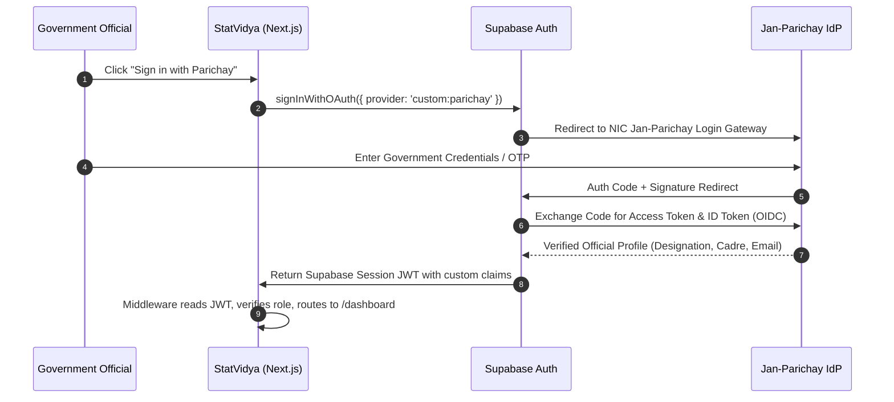
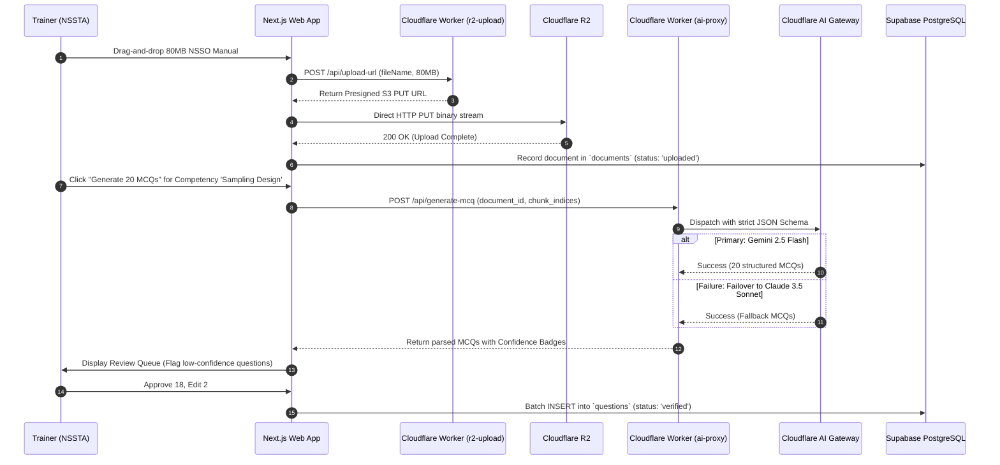
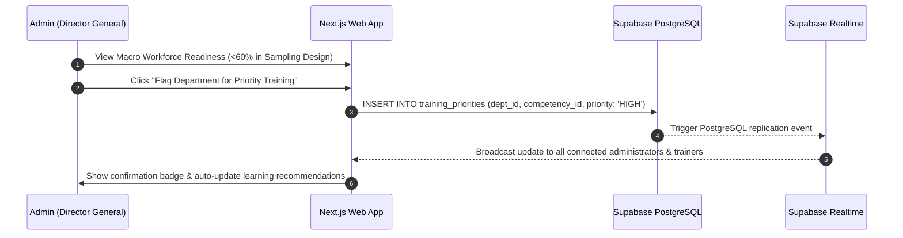

# Architecture.md

## StatVidya — System Architecture, App Flow & Full Technical Specification

| Field | Value |
|---|---|
| Companion document | PRD.md (defines *what* and *why*; this defines *how*) |
| Status | **Active v2.0 — Architecture Pivot (Supabase + Cloudflare + Next.js)** |
| Scope | Frontend (Next.js), Supabase (Postgres, RLS, Edge Functions), Cloudflare (R2, Workers, AI Gateway), Offline/PWA, Folder structure, Deployment |
| Target Framework | Smart India Hackathon (SIH 26101) / MoSPI / Mission Karmayogi (FRAC) |
| Last Updated | 2026-09-05 |

> **How to read this document**: This document is the authoritative engineering architecture for StatVidya. It translates the functional requirements and architectural pivot from **PRD.md v2.0** into a concrete, unambiguous blueprint for developers. Section 1 outlines the core architectural axioms. Sections 2 through 11 break down every layer of the 3-provider cloud topology. Section 12 details the sequence diagrams. Section 13 details the directory structure, and Section 14 logs the Architecture Decision Records (ADRs).

---

## Table of Contents

1. [Architectural Principles & Axioms](#1-architectural-principles--axioms)
2. [High-Level 3-Provider Topology](#2-high-level-3-provider-topology)
3. [Complete Tech Stack Specification](#3-complete-tech-stack-specification)
4. [Frontend Architecture (Next.js 15 + shadcn/ui)](#4-frontend-architecture-nextjs-15--shadcnui)
5. [Authentication & Identity Architecture (Supabase Auth + Parichay SSO)](#5-authentication--identity-architecture-supabase-auth--parichay-sso)
6. [Database Architecture (Supabase PostgreSQL + RLS Multi-Tenancy)](#6-database-architecture-supabase-postgresql--rls-multi-tenancy)
7. [Object Storage Architecture (Cloudflare R2 + Supabase Storage)](#7-object-storage-architecture-cloudflare-r2--supabase-storage)
8. [Serverless & Compute Architecture (Supabase Edge Functions + Cloudflare Workers)](#8-serverless--compute-architecture-supabase-edge-functions--cloudflare-workers)
9. [AI Architecture & Multi-Provider Fallback Gateway](#9-ai-architecture--multi-provider-fallback-gateway)
10. [Large PDF Processing Pipeline](#10-large-pdf-processing-pipeline)
11. [Offline-First & PWA Architecture (@serwist/next)](#11-offline-first--pwa-architecture-serwistnext)
12. [End-to-End App Flow & Sequence Diagrams](#12-end-to-end-app-flow--sequence-diagrams)
13. [Project Directory & File Structure](#13-project-directory--file-structure)
14. [Environments, Secrets & Configuration](#14-environments-secrets--configuration)
15. [Build, CI/CD & Deployment Workflow](#15-build-cicd--deployment-workflow)
16. [Architecture Decision Records (ADRs)](#16-architecture-decision-records-adrs)

---

## 1. Architectural Principles & Axioms

1. **Server Enforces, Client Suggests**:
   - Zero trust in client-submitted scores, competency levels, or role promotions.
   - All official mutations to `competencies`, `assessment_submissions`, and `audit_logs` are executed atomically with Firebase Auth token validation and Security Rules.
2. **Offline is a First-Class Capability, Not a Network Failure**:
   - Designed primarily around the constraints of the **Field Investigator (NSSO FOD)** on low-cost Android tablets in rural, disconnected regions.
   - Reads leverage `@serwist/next` Service Worker caching and Firestore offline persistence. Writes leverage a client-side IndexedDB queue with deterministic local UUIDs (`local_id`) ensuring idempotent, duplicate-safe sync upon reconnect.
3. **Unified Firebase Platform Topology**:
   - **Next.js App Router**: SSR/SSG rendering, client UI, and API route handlers.
   - **Firebase Authentication**: Email/Password, Google OAuth, and secure session management.
   - **Cloud Firestore**: Real-time document database with role-based `firestore.rules`.
   - **Firebase Storage**: Object storage for PDF survey manuals and training schedules governed by `storage.rules`.
4. **Structural Data Provenance**:
   - Every domain record (competencies, roles, activities, courses, questions) carries a mandatory `provenance` field (`VERIFIED_OFFICIAL`, `PROPOSED_FRAMEWORK`, `PROPOSED_METHODOLOGY`, `SYNTHETIC_DEMO_DATA`).
   - Enforced at the TypeScript type level and validated in PostgreSQL check constraints.
5. **Government-Ready Single Sign-On (SSO)**:
   - Built to natively interface with **Jan-Parichay / MeriPehchaan (NIC OIDC)**, while maintaining seamless one-click simulated demo personas for SIH jury evaluations.
6. **Immutable Audit Trails**:
   - Regulatory accountability is guaranteed via PostgreSQL triggers writing directly to an append-only `audit_log` table.
7. **Institutional Ground Truth (MoSPI & NSSTA Official Datasets)**:
   - Built directly on the datasets and official training manuals published on `nssta.gov.in` and `mospi.gov.in` as mandated by SIH PS 26101.
   - Real 100+ page NSS field manuals stream to Cloudflare R2 ($0 egress), statutory cadres (ISS, SSS, FOD) populate PostgreSQL `seed.sql`, official bilingual glossaries power the question bank, and field scrutiny error rates drive the outcome correlation engine (PRD §9.4).

---

## 2. High-Level 3-Provider Topology

```
┌──────────────────────────────────────────────────────────────────────────────────┐
│                                   CLIENT TIER                                     │
│  Next.js 15 App Router + Tailwind CSS v4 + shadcn/ui + @serwist/next PWA        │
│  State: TanStack Query + React Context | Storage: IndexedDB (idb)               │
└───────────────────┬──────────────────────────┬─────────────────────────┬─────────┘
                    │                          │                         │
      Direct HTTPS  │            BFF HTTPS     │           Upload/AI     │
      & Realtime WS │            API Routes    │           Edge Requests │
                    ▼                          ▼                         ▼
┌──────────────────────────────┐ ┌──────────────────────────┐ ┌──────────────────────────────┐
│       SUPABASE TIER          │ │       VERCEL TIER        │ │      CLOUDFLARE TIER         │
│                              │ │                          │ │                              │
│  ┌────────────────────────┐  │ │  ┌────────────────────┐  │ │  ┌────────────────────────┐  │
│  │ Supabase Auth          │  │ │  │ Next.js App Shell  │  │ │  │ Cloudflare Workers     │  │
│  │ • Email/Password       │  │ │  │ • Server Comps     │  │ │  │ • r2-upload (Presigned)│  │
│  │ • Google OAuth         │  │ │  │ • Client Comps     │  │ │  │ • ai-proxy (Sanitize)  │  │
│  │ • Parichay OIDC SSO    │  │ │  │ • Static Assets    │  │ │  └───────────┬────────────┘  │
│  └────────────────────────┘  │ │  └────────────────────┘  │ │              │               │
│  ┌────────────────────────┐  │ │  ┌────────────────────┐  │ │  ┌───────────▼────────────┐  │
│  │ PostgreSQL 16+ (RLS)   │  │ │  │ API Route Handlers │  │ │  │ Cloudflare R2 Storage  │  │
│  │ • Org-Scoped Tenancy   │  │ │  │ • Server Auth Gate │  │ │  │ • Large Training PDFs  │  │
│  │ • FRAC Model Tables    │  │ │  │ • Session Verify   │  │ │  │ • Multi-part ($0 egress│  │
│  │ • Append-Only Audit    │  │ │  └────────────────────┘  │ │  └────────────────────────┘  │
│  └────────────────────────┘  │ └──────────────────────────┘ │  ┌────────────────────────┐  │
│  ┌────────────────────────┐  │                              │  │ Cloudflare AI Gateway  │  │
│  │ Supabase Edge Funcs    │  │                              │  │ • Multi-provider chain │  │
│  │ • evaluate-assessment  │  │                              │  │ • Rate Limiting & Cache│  │
│  │ • competency-update    │  │                              │  └───────────┬────────────┘  │
│  └────────────────────────┘  │                              └──────────────┼───────────────┘
│  ┌────────────────────────┐  │                                             │
│  │ Supabase Realtime      │  │                                             ▼
│  │ • WebSocket Pub/Sub    │  │                              ┌──────────────────────────────┐
│  └────────────────────────┘  │                              │    EXTERNAL AI PROVIDERS     │
│  ┌────────────────────────┐  │                              │  1. Google Gemini 2.5 Flash  │
│  │ Supabase Storage       │  │                              │  2. Anthropic Claude 3.5 Son │
│  │ • Avatars & Small Icons│  │                              │  3. OpenAI GPT-4o-mini       │
│  └────────────────────────┘  │                              │  4. Rule-Based Fallback (ts) │
└──────────────────────────────┘                              └──────────────────────────────┘
```

### Component Responsibility Matrix

| Layer | Technology | Primary Role | Why Selected |
|---|---|---|---|
| **Frontend** | Next.js 15 (App Router), React 19, TypeScript | UI rendering, SSR/SSG, routing, client state | Fast initial load, SEO, modern server components, standard gov-tech framework |
| **Styling & UI** | Tailwind CSS v4, shadcn/ui, Radix Primitives | Accessible UI components, bilingual typography, dark mode | OKLCH color spaces, accessibility out of the box, zero runtime CSS overhead |
| **PWA / Offline** | `@serwist/next`, `idb` (IndexedDB) | Offline shell precaching, assessment answer queue | Seamless service worker integration in Next.js, offline sync without data loss |
| **Auth** | Supabase Auth (GoTrue) | JWT issuance, Google OAuth, Parichay OIDC SSO | Direct integration with PostgreSQL RLS; native OIDC provider support |
| **Database** | Supabase PostgreSQL 16+ | Relational data, RLS multi-tenancy, triggers | ACID transactions, strict schema, built-in row level security |
| **Serverless Backend** | Supabase Edge Functions (Deno) | Assessment grading, scoring formulas, audit triggers | Low latency colocation with database, zero cold starts, TypeScript runtime |
| **Large File Storage** | Cloudflare R2 | PDF manuals (>50MB), training assets | **$0 egress fees**, S3-compatible API, fast global edge delivery |
| **Edge Compute & AI Proxy** | Cloudflare Workers | Presigned URL generator, AI request sanitizer | Sub-millisecond execution, shields upstream AI keys, near-user edge execution |
| **AI Gateway** | Cloudflare AI Gateway | Multi-provider fallback, rate limiting, token caching | Automatic failover: Gemini → Claude → OpenAI; prevents outages during demos |

---

## 3. Complete Tech Stack Specification

| Category | Specification | Version / Details |
|---|---|---|
| **Language** | TypeScript | `v5.5+` (strict mode, `noUncheckedIndexedAccess: true`) |
| **Web Framework** | Next.js (App Router) | `v15.1+` (Node.js 20+ runtime for API routes) |
| **Client Core** | React | `v19.0` |
| **CSS Framework** | Tailwind CSS | `v4.0` (inline `@theme`, OKLCH tokens, no legacy config) |
| **UI Library** | shadcn/ui | Radix UI primitives, Lucide React icons |
| **Typography** | Google Fonts | Inter (Latin/English), Noto Sans Devanagari (Hindi), JetBrains Mono (Code/IDs) |
| **Charting** | Recharts + Bespoke SVG | SVG for Radar / Progress Rings; Recharts for Scatter & Trendlines |
| **i18n** | `next-intl` or `i18next` | Fully bilingual English (`en`) and Hindi (`hi`) |
| **PWA Service Worker**| `@serwist/next` | Workbox-based service worker for Next.js App Router |
| **Client Storage** | `idb` | Typed IndexedDB wrapper for `pending_assessments` |
| **Database** | PostgreSQL | `16.x` managed by Supabase |
| **ORM / Data Client** | `@supabase/supabase-js` | Typed database client with generated schema types |
| **Serverless Compute** | Supabase Edge Functions | Deno 1.40+, TypeScript |
| **Edge Storage & Proxy**| Cloudflare Workers + R2 | S3 API client via `@aws-sdk/client-s3` (presigned URLs) |
| **AI Orchestration** | Cloudflare AI Gateway | Universal endpoint routing with automatic failover |
| **Primary AI Model** | Google Gemini 2.5 Flash | Fast, JSON schema enforcement, cost-effective |
| **Secondary AI Model** | Anthropic Claude 3.5 Sonnet | Deep comprehension, structured reasoning fallback |
| **Tertiary AI Model** | OpenAI GPT-4o-mini | Emergency fallback tier |
| **Code Fallback AI** | In-Repo Rule-Based Engine | Zero external dependencies; 100% offline generation capability |
| **Testing** | Vitest + Testing Library | Formula verification, component testing |
| **Deployment** | Vercel + Cloudflare + Supabase | Vercel (Web), Cloudflare (Workers/R2), Supabase (DB/Edge) |

---

## 4. Frontend Architecture (Next.js 15 + shadcn/ui)

### 4.1 Route Map & Access Hierarchy

All routes live inside the Next.js `app/` directory. Role-based protection is implemented at the edge via `middleware.ts` (validating the Supabase session cookie) and confirmed via UI guards and PostgreSQL RLS.

```
app/
├── (auth)/
│   ├── login/page.tsx               # Email/Password + Google + Parichay SSO button
│   ├── sso/callback/route.ts        # OIDC callback handler
│   └── sso/demo-persona/route.ts    # Simulated Parichay persona quick-switch
├── (onboarding)/
│   └── onboarding/page.tsx          # Cadre, Role & initial FRAC self-assessment
├── (dashboard)/
│   ├── layout.tsx                   # Main App Shell: Sidebar, Topbar, Breadcrumbs, OfflineBar
│   ├── dashboard/page.tsx           # Role-adaptive Dashboard (Learner / Trainer / Admin)
│   ├── profile/page.tsx             # Official profile, Verified vs Self-assessed Badges
│   ├── skill-gap/page.tsx           # FRAC Competency Radar, Gap Severity ranking
│   ├── pathways/page.tsx            # iGOT course recommendations, Karma points
│   ├── assessment/
│   │   ├── page.tsx                 # Available assessments list
│   │   └── [id]/page.tsx            # Active assessment runner (Offline-capable)
│   ├── documents/
│   │   ├── page.tsx                 # PDF Document manager (Trainer/Admin)
│   │   └── [id]/page.tsx            # PDF Document detail & extraction status
│   ├── mcq-generator/
│   │   └── [documentId]/page.tsx    # AI MCQ Generation pipeline & Review Queue
│   ├── question-bank/page.tsx       # Verified Question repository & tagging
│   └── admin/
│       ├── analytics/page.tsx       # Macro Workforce Readiness & Outcome Correlation
│       └── users/[uid]/page.tsx     # Admin individual official drill-down
└── settings/page.tsx                # Preferences (Language EN/HI, Theme Dark/Light)
```

### 4.2 Middleware Route Guard (`middleware.ts`)

The Next.js edge middleware intercepts requests to enforce authentication and role isolation:

```typescript
// middleware.ts
import { createServerClient } from '@supabase/ssr';
import { NextResponse, type NextRequest } from 'next/server';

export async function middleware(request: NextRequest) {
  let response = NextResponse.next({ request });

  const supabase = createServerClient(
    process.env.NEXT_PUBLIC_SUPABASE_URL!,
    process.env.NEXT_PUBLIC_SUPABASE_ANON_KEY!,
    {
      cookies: {
        getAll() { return request.cookies.getAll(); },
        setAll(cookiesToSet) {
          cookiesToSet.forEach(({ name, value, options }) => {
            request.cookies.set(name, value);
            response.cookies.set(name, value, options);
          });
        },
      },
    }
  );

  const { data: { user } } = await supabase.auth.getUser();
  const path = request.nextUrl.pathname;

  // 1. Unauthenticated redirect to login
  if (!user && !path.startsWith('/login') && !path.startsWith('/sso') && path !== '/') {
    return NextResponse.redirect(new URL('/login', request.url));
  }

  // 2. Role-based route protection
  if (user) {
    const role = user.user_metadata?.role || 'learner';

    if (path.startsWith('/admin') && role !== 'admin') {
      return NextResponse.redirect(new URL('/dashboard', request.url));
    }
    if ((path.startsWith('/documents') || path.startsWith('/mcq-generator')) && 
        role !== 'trainer' && role !== 'admin') {
      return NextResponse.redirect(new URL('/dashboard', request.url));
    }
  }

  return response;
}

export const config = {
  matcher: ['/((?!_next/static|_next/image|favicon.ico|manifest.json|icons/).*)'],
};
```

---

## 5. Authentication & Identity Architecture (Supabase Auth + Parichay SSO)

### 5.1 Dual-Track Identity Flow

StatVidya implements an institutional identity architecture supporting both real-world government deployments and instantaneous hackathon evaluation:

```
                          ┌───────────────────────────┐
                          │   StatVidya Login UI      │
                          └─────────────┬─────────────┘
                                        │
           ┌────────────────────────────┼───────────────────────────┐
           ▼                            ▼                           ▼
┌───────────────────────┐  ┌─────────────────────────┐  ┌───────────────────────┐
│ Real Parichay OIDC    │  │ Simulated Demo Personas │  │ Standard Auth         │
│ (Production / Pilot)  │  │ (SIH Evaluation Mode)   │  │ (Email / Google)      │
└──────────┬────────────┘  └────────────┬────────────┘  └───────────┬───────────┘
           │                            │                           │
           ▼                            ▼                           ▼
┌───────────────────────┐  ┌─────────────────────────┐  ┌───────────────────────┐
│ Redirect to NIC       │  │ Instant Custom JWT via  │  │ Supabase Auth Native  │
│ Jan-Parichay Gateway  │  │ Admin Service Role Key  │  │ Sign-In Flow          │
│ (OAuth2 Authorization)│  │ (No credentials entered)│  │ (Session Cookie)      │
└──────────┬────────────┘  └────────────┬────────────┘  └───────────┬───────────┘
           │                            │                           │
           └────────────────────────────┼───────────────────────────┘
                                        ▼
                       ┌─────────────────────────────────┐
                       │ Supabase Auth Session (JWT)     │
                       │ Claims: { uid, org_id, role }   │
                       └────────────────┬────────────────┘
                                        ▼
                       ┌─────────────────────────────────┐
                       │ PostgreSQL RLS Security Context │
                       │ auth.uid() & auth.jwt()         │
                       └─────────────────────────────────┘
```

### 5.2 Pre-Seeded Demo Personas (SIH 26101 Evaluator Experience)

To eliminate login friction during live jury demonstrations, four pre-configured personas map directly to key stakeholder roles:

| Persona Name | Official Designation | Cadre / Organization | Assigned Role | Default Locale | Primary Workflow |
|---|---|---|---|---|---|
| **Amit Sharma** | Junior Statistical Officer (JSO) | NSSO (FOD) | `learner` | English (`en`) | Desk-based gap analysis, iGOT course enrolment |
| **Sunita Devi** | Field Investigator (FI) | NSSO Field Office (Bihar) | `learner` | Hindi (`hi`) | Offline assessment runner, rural field tablet UI |
| **Dr. Priya Verma** | Faculty Member | NSSTA (National Academy) | `trainer` | English (`en`) | Upload large manuals, AI MCQ batching, review queue |
| **Rajesh Kumar** | Additional Director General | MoSPI Headquarters | `admin` | English (`en`) | Macro readiness index, outcome correlation, priority flag |

### 5.3 Simulated Parichay SSO Implementation (`app/(auth)/sso/demo-persona/route.ts`)

```typescript
// app/(auth)/sso/demo-persona/route.ts
import { createAdminClient } from '@/lib/supabase/admin';
import { cookies } from 'next/headers';
import { NextResponse } from 'next/server';

export async function POST(request: Request) {
  const { personaId } = await request.json();
  const adminClient = createAdminClient();

  // Pre-configured persona mapping
  const personas: Record<string, { email: string; role: string; orgId: string; lang: string }> = {
    'amit-jso': { email: 'amit.sharma@mospi.gov.in', role: 'learner', orgId: 'mospi-nsso', lang: 'en' },
    'sunita-fi': { email: 'sunita.devi@mospi.gov.in', role: 'learner', orgId: 'mospi-fod', lang: 'hi' },
    'priya-trainer': { email: 'priya.verma@nssta.gov.in', role: 'trainer', orgId: 'nssta-academy', lang: 'en' },
    'rajesh-admin': { email: 'rajesh.kumar@mospi.gov.in', role: 'admin', orgId: 'mospi-hq', lang: 'en' },
  };

  const persona = personas[personaId];
  if (!persona) {
    return NextResponse.json({ error: 'Invalid persona' }, { status: 400 });
  }

  // Generate session link or sign in user via admin client
  const { data: user, error: userError } = await adminClient.auth.admin.getUserByEmail(persona.email);
  if (userError || !user) {
    return NextResponse.json({ error: 'Persona not seeded' }, { status: 500 });
  }

  const { data: linkData, error: linkError } = await adminClient.auth.admin.generateLink({
    type: 'magiclink',
    email: persona.email,
  });

  if (linkError) return NextResponse.json({ error: linkError.message }, { status: 500 });

  return NextResponse.json({ redirectUrl: linkData.properties.action_link });
}
```

---

## 6. Database Architecture (Supabase PostgreSQL + RLS Multi-Tenancy)

### 6.1 Relational Schema & Entity Relationship Overview

The complete database schema is organized into 6 core domains:
1. **Tenancy & Core Identity**: `organizations`, `users`
2. **FRAC Competency Framework**: `roles`, `activities`, `competencies`, `activity_competencies`, `role_activities`
3. **Official Competency State**: `competency_records`, `competency_history`
4. **Assessment & Question Bank**: `assessments`, `questions`, `assessment_results`
5. **Content & Training Catalog**: `documents`, `courses`, `course_competencies`, `course_enrollments`
6. **Regulatory Intelligence**: `training_priorities`, `survey_outcomes`, `audit_log`

```
┌─────────────────┐       ┌─────────────────┐       ┌────────────────────────┐
│  organizations  │◄──────┤      users      │◄──────┤   competency_records   │
└────────┬────────┘       └────────┬────────┘       └───────────┬────────────┘
         │                         │                            │
         │                         ▼                            ▼
         │                ┌─────────────────┐       ┌────────────────────────┐
         ├───────────────►│  audit_log      │       │   competency_history   │
         │                └─────────────────┘       └────────────────────────┘
         │
         ▼
┌─────────────────┐       ┌─────────────────┐       ┌────────────────────────┐
│     roles       │◄──────┤ role_activities │──────►│       activities       │
└─────────────────┘       └─────────────────┘       └───────────┬────────────┘
                                                                │
                                                                ▼
┌─────────────────┐       ┌───────────────────────┐ ┌────────────────────────┐
│    courses      │◄──────┤  course_competencies  │ │ activity_competencies  │
└────────┬────────┘       └───────────────────────┘ └───────────┬────────────┘
         │                                                      │
         ▼                                                      ▼
┌─────────────────┐                                 ┌────────────────────────┐
│ course_enrols   │                                 │      competencies      │
└─────────────────┘                                 └───────────┬────────────┘
                                                                │
         ┌──────────────────────────────────────────────────────┤
         ▼                                                      ▼
┌─────────────────┐       ┌─────────────────┐       ┌────────────────────────┐
│    documents    │──────►│    questions    │◄──────┤      assessments       │
└─────────────────┘       └────────┬────────┘       └───────────┬────────────┘
                                   │                            │
                                   └──────────────┬─────────────┘
                                                  ▼
                                      ┌───────────────────────┐
                                      │  assessment_results   │
                                      └───────────────────────┘
```

### 6.2 Row Level Security (RLS) Policy Specifications

Multi-tenant isolation is strictly enforced at the database level by comparing `organization_id` on each row against the authenticated user's organization claim:

```sql
-- Helper functions for concise RLS policies
CREATE OR REPLACE FUNCTION auth.org_id() RETURNS text AS $$
  SELECT coalesce(
    current_setting('request.jwt.claims', true)::json->'app_metadata'->>'organization_id',
    (SELECT organization_id FROM public.users WHERE id = auth.uid())
  );
$$ LANGUAGE sql STABLE;

CREATE OR REPLACE FUNCTION auth.role() RETURNS text AS $$
  SELECT coalesce(
    current_setting('request.jwt.claims', true)::json->'app_metadata'->>'role',
    (SELECT role FROM public.users WHERE id = auth.uid())
  );
$$ LANGUAGE sql STABLE;

-- 1. Organizations Policy: Users can only read their own organization
ALTER TABLE organizations ENABLE ROW LEVEL SECURITY;
CREATE POLICY "org_read_own" ON organizations FOR SELECT TO authenticated
  USING (id = auth.org_id());

-- 2. Users Policy: Read members of own org; update only self
ALTER TABLE users ENABLE ROW LEVEL SECURITY;
CREATE POLICY "users_read_org" ON users FOR SELECT TO authenticated
  USING (organization_id = auth.org_id());
CREATE POLICY "users_update_self" ON users FOR UPDATE TO authenticated
  USING (id = auth.uid())
  WITH CHECK (id = auth.uid() AND organization_id = auth.org_id());

-- 3. Competency Records Policy: Read own records (or admin reads org); mutations strictly via Edge Functions
ALTER TABLE competency_records ENABLE ROW LEVEL SECURITY;
CREATE POLICY "comp_read_self" ON competency_records FOR SELECT TO authenticated
  USING (user_id = auth.uid() OR auth.role() = 'admin');
CREATE POLICY "comp_deny_client_insert" ON competency_records FOR INSERT TO authenticated
  WITH CHECK (false); -- Enforced via Edge Function service_role
CREATE POLICY "comp_deny_client_update" ON competency_records FOR UPDATE TO authenticated
  USING (false);

-- 4. Assessment Results Policy: Learner creates/reads own; mutations immutable
ALTER TABLE assessment_results ENABLE ROW LEVEL SECURITY;
CREATE POLICY "results_read_self" ON assessment_results FOR SELECT TO authenticated
  USING (user_id = auth.uid() OR auth.role() = 'admin');
CREATE POLICY "results_insert_self" ON assessment_results FOR INSERT TO authenticated
  WITH CHECK (user_id = auth.uid() AND organization_id = auth.org_id());
CREATE POLICY "results_deny_update" ON assessment_results FOR UPDATE TO authenticated
  USING (false); -- Immutable once written
```

### 6.3 Automated Audit & Promotion Trigger Architecture

Whenever a row is inserted into `assessment_results`, an internal PostgreSQL trigger ensures state integrity and appends to the immutable audit log:

```sql
-- Trigger Function: Process assessment completion and record audit log
CREATE OR REPLACE FUNCTION fn_on_assessment_result_created()
RETURNS TRIGGER AS $$
BEGIN
  -- 1. Insert into immutable audit log
  INSERT INTO audit_log (
    organization_id,
    user_id,
    action,
    entity_type,
    entity_id,
    details
  ) VALUES (
    NEW.organization_id,
    NEW.user_id,
    'ASSESSMENT_COMPLETED',
    'assessment_results',
    NEW.id,
    jsonb_build_object(
      'assessment_id', NEW.assessment_id,
      'score', NEW.score,
      'passed', NEW.passed,
      'offline_sync', NEW.is_offline_sync
    )
  );

  RETURN NEW;
END;
$$ LANGUAGE plpgsql SECURITY DEFINER;

CREATE TRIGGER tr_on_assessment_result_created
AFTER INSERT ON assessment_results
FOR EACH ROW EXECUTE FUNCTION fn_on_assessment_result_created();
```

---

## 7. Object Storage Architecture (Cloudflare R2 + Supabase Storage)

### 7.1 Separation of Storage Responsibilities

| Asset Class | Provider | Bucket Name | Access Control | Cost / Egress Strategy |
|---|---|---|---|---|
| **Large Manuals & PDFs** (>50MB, up to 500MB) | **Cloudflare R2** | `statvidya-documents` | Private (Presigned PUT/GET URLs via Cloudflare Worker) | **$0 egress fees**, chunked multipart upload |
| **Avatars & Profile Images** (<5MB) | **Supabase Storage** | `avatars` | Public read, authenticated write | Native Supabase client upload |
| **PWA Cached Assets** | Client Cache Storage | Cache API | Managed by Service Worker | Local device storage |

### 7.2 Presigned URL Direct-to-R2 Upload Flow

To prevent massive PDF manuals from choking server memory or incurring bandwidth charges, uploads never transit through Next.js or Supabase servers:

```
┌──────────┐              ┌──────────────────┐               ┌───────────────┐
│  Client  │              │ Cloudflare Worker│               │ Cloudflare R2 │
│ (Browser)│              │  (r2-upload)     │               │  (S3 Bucket)  │
└────┬─────┘              └────────┬─────────┘               └───────┬───────┘
     │ 1. POST /api/upload-url     │                                 │
     │    { fileName, fileSize }   │                                 │
     │────────────────────────────►│                                 │
     │                             │ 2. Validate auth JWT            │
     │                             │    Generate S3 Presigned PUT    │
     │                             │    (15 min expiration)          │
     │ 3. Return presignedUrl      │                                 │
     │◄────────────────────────────│                                 │
     │                                                               │
     │ 4. Direct PUT binary stream to presignedUrl                   │
     │──────────────────────────────────────────────────────────────►│
     │                                                               │
     │ 5. HTTP 200 OK                                                │
     │◄──────────────────────────────────────────────────────────────│
     │                                                               │
     │ 6. Inform Supabase DB: INSERT INTO documents status='uploaded'│
     └───────────────────────────────────────────────────────────────┘
```

---

## 8. Serverless & Compute Architecture (Supabase Edge Functions + Cloudflare Workers)

### 8.1 Execution Distribution

| Function Name | Runtime | Host Provider | Trigger | Primary Objective |
|---|---|---|---|---|
| `evaluate-assessment` | Deno / TypeScript | Supabase Edge | HTTPS POST | Validates answers, calculates raw & percentage scores, evaluates level-up thresholds, updates `competency_records` in a single transaction. |
| `r2-upload` | V8 Worker | Cloudflare Workers | HTTPS POST | Authenticates trainer/admin, signs AWS S3 v4 PUT/GET URLs for direct Cloudflare R2 file transfer. |
| `ai-proxy` | V8 Worker | Cloudflare Workers | HTTPS POST | Validates prompt parameters, enforces token rate-limiting, and routes through Cloudflare AI Gateway. |
| `generate-narrative` | Deno / TypeScript | Supabase Edge | HTTPS POST | Aggregates organization-wide competency metrics for Director-level executive summaries. |

### 8.2 Supabase Edge Function: Assessment Evaluation (`evaluate-assessment`)

```typescript
// supabase/functions/evaluate-assessment/index.ts
import { serve } from 'https://deno.land/std@0.177.0/http/server.ts';
import { createClient } from 'https://esm.sh/@supabase/supabase-js@2.39.0';

serve(async (req) => {
  const { localId, assessmentId, answers } = await req.json();
  const authHeader = req.headers.get('Authorization')!;

  const supabase = createClient(
    Deno.env.get('SUPABASE_URL')!,
    Deno.env.get('SUPABASE_SERVICE_ROLE_KEY')!
  );

  // 1. Idempotency Check: Prevent duplicate credit for retried offline sync
  const { data: existing } = await supabase
    .from('assessment_results')
    .select('id, score, passed')
    .eq('local_id', localId)
    .maybeSingle();

  if (existing) {
    return new Response(JSON.stringify({ status: 'ALREADY_PROCESSED', result: existing }), {
      headers: { 'Content-Type': 'application/json' },
    });
  }

  // 2. Fetch ground-truth questions and scoring keys
  const { data: assessment } = await supabase
    .from('assessments')
    .select('*, questions(*)')
    .eq('id', assessmentId)
    .single();

  let correctCount = 0;
  const totalQuestions = assessment.questions.length;

  assessment.questions.forEach((q: any) => {
    if (answers[q.id] === q.correct_option_index) {
      correctCount++;
    }
  });

  const percentage = Math.round((correctCount / totalQuestions) * 100);
  const passed = percentage >= assessment.pass_percentage;

  // 3. Atomically record result and update competency records
  const { data: result, error } = await supabase
    .from('assessment_results')
    .insert({
      local_id: localId,
      assessment_id: assessmentId,
      user_id: req.headers.get('x-user-id'),
      organization_id: req.headers.get('x-org-id'),
      score: percentage,
      passed,
      answers_payload: answers,
      is_offline_sync: req.headers.get('x-offline-sync') === 'true',
    })
    .select()
    .single();

  return new Response(JSON.stringify({ success: true, score: percentage, passed }), {
    headers: { 'Content-Type': 'application/json' },
  });
});
```

---

## 9. AI Architecture & Multi-Provider Fallback Gateway

### 9.1 The Resilience Fallback Chain

To guarantee 100% uptime during SIH hackathon evaluation and production operations, StatVidya implements a multi-provider fallback hierarchy routed through Cloudflare AI Gateway:

```
                           ┌──────────────────────────────┐
                           │   Trainer Requests AI MCQs   │
                           └──────────────┬───────────────┘
                                          │
                                          ▼
                           ┌──────────────────────────────┐
                           │ Cloudflare Worker (ai-proxy) │
                           └──────────────┬───────────────┘
                                          │
                                          ▼
                           ┌──────────────────────────────┐
                           │   Cloudflare AI Gateway      │
                           │   (Universal Endpoint)       │
                           └──────────────┬───────────────┘
                                          │
         ┌────────────────────────────────┼───────────────────────────────┐
         │ Tier 1                         │ Tier 2 (Timeout / Quota)      │ Tier 3 (Error)
         ▼                                ▼                               ▼
┌─────────────────────────┐      ┌─────────────────────────┐     ┌─────────────────────────┐
│ Google Gemini 2.5 Flash │      │ Anthropic Claude 3.5 Son│     │ OpenAI GPT-4o-mini      │
│ Model: gemini-2.5-flash │      │ Model: claude-3-5-sonnet│     │ Model: gpt-4o-mini      │
└────────┬────────────────┘      └────────┬────────────────┘     └────────┬────────────────┘
         │                                │                               │
         └─────────────────┬──────────────┴───────────────────────────────┘
                           │ All Cloud Providers Fail
                           ▼
                  ┌─────────────────────────────────┐
                  │ In-Repo Rule-Based Generator    │
                  │ (Extracts terms, constructs     │
                  │ grammatical templates locally)  │
                  └─────────────────────────────────┘
```

### 9.2 Strict JSON Schema Enforcement

Every AI model invocation enforces strict JSON formatting to guarantee parsing reliability:

```typescript
// workers/ai-proxy/src/schema.ts
export const MCQ_RESPONSE_SCHEMA = {
  type: 'object',
  properties: {
    questions: {
      type: 'array',
      items: {
        type: 'object',
        properties: {
          stem: { type: 'string', description: 'Question text in English' },
          stem_hi: { type: 'string', description: 'Question text in Hindi (Devanagari)' },
          options: {
            type: 'array',
            items: { type: 'string' },
            minItems: 4,
            maxItems: 4,
          },
          options_hi: {
            type: 'array',
            items: { type: 'string' },
            minItems: 4,
            maxItems: 4,
          },
          correct_option_index: { type: 'integer', minimum: 0, maximum: 3 },
          explanation: { type: 'string' },
          explanation_hi: { type: 'string' },
          competency_code: { type: 'string', description: 'FRAC Competency identifier' },
          bloom_level: { type: 'string', enum: ['REMEMBER', 'UNDERSTAND', 'APPLY', 'ANALYZE'] },
          confidence: { type: 'string', enum: ['HIGH', 'MEDIUM', 'LOW'] },
        },
        required: [
          'stem', 'stem_hi', 'options', 'options_hi', 
          'correct_option_index', 'explanation', 'competency_code', 'confidence'
        ],
      },
    },
  },
  required: ['questions'],
};
```

---

## 10. Large PDF Processing Pipeline

Official government statistical manuals published on **`mospi.gov.in`** and **`nssta.gov.in`** (such as the *NSS Instructions to Field Staff Vol. I & II* or *NSSTA In-Service Training Manuals on Official Statistics*) frequently exceed 200+ pages and 50MB. Processing these dense, highly technical publications requires a structured 5-stage pipeline:

```
Stage 1: Direct R2 Upload  ──► Client streams raw MoSPI/NSSTA PDF directly to Cloudflare R2 via presigned URL
Stage 2: Client/Edge Chunk ──► PDF.js parses structure; splits into semantic sections (1,500 words per chapter/para)
Stage 3: Metadata Extract  ──► Rule-based extraction of Chapter headings (Schedule 0.0, FSU/USU, Sampling frames)
Stage 4: Batched AI Call   ──► Chunks dispatched to AI Gateway with strict FRAC competency prompt & JSON schema
Stage 5: Review & Sanity   ──► Questions enter Trainer Review Queue; low-confidence flagged first, citing source para
```

```
┌───────────────────────────────────────────────────────────────────────────────┐
│                      STAGE 5: TRAINER CONFIDENCE REVIEW QUEUE                 │
├───────────────────────────────────────────────────────────────────────────────┤
│ [HIGH CONFIDENCE]   ✅ Auto-approved for Question Bank (Direct match to text)  │
│ [MEDIUM CONFIDENCE] ⚠️ Highlighted for quick trainer check                    │
│ [LOW CONFIDENCE]    🔴 Manual review mandatory; AI reasoning displayed       │
└───────────────────────────────────────────────────────────────────────────────┘
```

---

## 11. Offline-First & PWA Architecture (@serwist/next)

### 11.1 The Dual-Store Offline Strategy

To allow Field Investigators to execute surveys and assessments in zero-connectivity environments:

1. **Service Worker (Read Cache)**:
   - Built with `@serwist/next` (modern Next.js App Router replacement for next-pwa).
   - Precaches the application shell (HTML, CSS, JS bundles, static icons).
   - Stale-While-Revalidate caching strategy for active assessments and question banks.
2. **IndexedDB (Write Queue)**:
   - Handled via `idb` under database `statvidya_offline`.
   - Stores queued submissions in object store `pending_assessments`.

### 11.2 Offline Submission & Reconciliation Flow

```
Learner Completes Assessment Offline
                 │
                 ▼
Generate local UUID (`local_id`)
                 │
                 ▼
Enqueue submission payload to IndexedDB (`pending_assessments`)
Set status = 'PENDING'
                 │
                 ▼
Show Persistent UI Banner: "🟠 1 Assessment Pending Sync"
                 │
                 ▼
Network connectivity restored (`window.online` or Service Worker sync)
                 │
                 ▼
Flush queue: POST to Supabase Edge Function `evaluate-assessment`
Headers: { 'x-offline-sync': 'true' }
                 │
     ┌───────────┴───────────┐
     ▼                       ▼
  Success                 Failure
     │                       │
     ▼                       ▼
Mark status='SYNCED'    Apply exponential backoff (1s, 2s, 4s, 8s...)
Remove from IndexedDB   Max 5 retries; provide manual "Retry Now" button
Update UI: "✅ Synced"
```

---

## 12. End-to-End App Flow & Sequence Diagrams

### 12.1 Parichay SSO Authentication Flow



### 12.2 Trainer PDF-to-MCQ Generation Sequence



### 12.3 Admin Workforce Priority Write-Back Sequence



---

## 13. Project Directory & File Structure

```
statvidya/
├── app/                                   # Next.js 15 App Router
│   ├── (auth)/                            # Authentication routes
│   │   ├── login/page.tsx
│   │   ├── sso/callback/route.ts
│   │   └── sso/demo-persona/route.ts
│   ├── (onboarding)/                      # First-time user setup
│   │   └── onboarding/page.tsx
│   ├── (dashboard)/                       # Authenticated workspace
│   │   ├── layout.tsx                     # Shell (Sidebar, Topbar, OfflineBar)
│   │   ├── dashboard/page.tsx             # Role-adaptive Dashboard
│   │   ├── profile/page.tsx               # Competency records & badges
│   │   ├── skill-gap/page.tsx             # Radar chart & gap severity
│   │   ├── pathways/page.tsx              # iGOT course recommendations
│   │   ├── assessment/
│   │   │   ├── page.tsx                   # Assessment listings
│   │   │   └── [id]/page.tsx              # Assessment runner (Offline enabled)
│   │   ├── documents/
│   │   │   ├── page.tsx                   # PDF upload & listing
│   │   │   └── [id]/page.tsx              # Document extraction preview
│   │   ├── mcq-generator/
│   │   │   └── [documentId]/page.tsx      # AI MCQ Generator & review queue
│   │   ├── question-bank/page.tsx         # Verified question repository
│   │   └── admin/
│   │       ├── analytics/page.tsx         # Macro readiness & correlation
│   │       └── users/[uid]/page.tsx       # Individual official inspection
│   ├── settings/page.tsx                  # Language (EN/HI) & theme
│   ├── api/                               # Next.js BFF Route Handlers
│   │   ├── auth/session/route.ts
│   │   └── sync/offline-status/route.ts
│   ├── globals.css                        # Tailwind CSS v4 (@theme inline)
│   ├── layout.tsx                         # Root layout (Fonts, Providers)
│   └── sw.ts                              # Serwist Service Worker entry
│
├── components/                            # React UI Components
│   ├── ui/                                # shadcn/ui primitives (Button, Card, Dialog...)
│   ├── layout/                            # AppLayout, Sidebar, Topbar, OfflineIndicator
│   ├── charts/                            # RadarChart, ProgressRing, ScatterTrendChart
│   ├── badges/                            # ProvenanceBadge, ConfidenceBadge, RoleBadge
│   └── guards/                            # RoleGate, AuthGate
│
├── lib/                                   # Core utilities & client instances
│   ├── supabase/
│   │   ├── client.ts                      # Client-side Supabase browser client
│   │   ├── server.ts                      # Server-side Supabase server client
│   │   └── admin.ts                       # Admin service-role client (API routes only)
│   ├── idb/
│   │   └── offlineQueue.ts                # IndexedDB offline assessment store
│   └── utils.ts                           # Class merging (cn), formatting
│
├── services/                              # Framework-Agnostic Domain Logic
│   ├── competencyService.ts               # Severity formulas, readiness index
│   ├── assessmentService.ts               # Adaptive branching, answer scoring
│   ├── recommendationService.ts           # iGOT course ranking & weighting
│   ├── contentService.ts                  # Document chunking & extraction
│   ├── storageService.ts                  # Cloudflare R2 presigned upload client
│   ├── offlineService.ts                  # Queue dispatcher, auto-sync listener
│   └── questionGenerator.ts               # Local rule-based fallback generator
│
├── types/                                 # Shared TypeScript Definitions
│   ├── database.types.ts                  # Supabase generated database types
│   ├── frac.types.ts                      # Role, Activity, Competency interfaces
│   ├── assessment.types.ts                # Questions, Results, Options
│   └── provenance.types.ts                # Provenance enums & constraints
│
├── supabase/                              # Supabase Configuration & Migrations
│   ├── migrations/
│   │   ├── 001_initial_schema.sql         # Base tables, foreign keys, enums
│   │   ├── 002_rls_policies.sql           # Row-level security policies
│   │   └── 003_triggers_and_audit.sql     # Database triggers & audit logging
│   ├── functions/                         # Deno Edge Functions
│   │   ├── evaluate-assessment/index.ts
│   │   └── generate-narrative/index.ts
│   ├── seed.sql                           # FRAC Official Framework Seed Data
│   └── config.toml
│
├── workers/                               # Cloudflare Workers
│   ├── r2-upload/                         # Presigned URL generation worker
│   │   ├── src/index.ts
│   │   └── wrangler.toml
│   └── ai-proxy/                          # Cloudflare AI Gateway proxy worker
│       ├── src/index.ts
│       └── wrangler.toml
│
├── public/                                # Static Assets
│   ├── manifest.json                      # PWA Web App Manifest
│   ├── icons/                             # PWA 192x192, 512x512 icons
│   └── locales/                           # Localization dictionary files
│       ├── en.json
│       └── hi.json
│
├── tests/                                 # Unit & Integration Tests
│   ├── formulas.test.ts                   # Severity score & readiness unit tests
│   └── adaptiveBranching.test.ts          # 3-stage decision tree tests
│
├── middleware.ts                          # Edge Route Guard
├── next.config.ts                         # Next.js configuration (Serwist PWA)
├── tsconfig.json                          # Strict TypeScript configuration
└── package.json
```

---

## 14. Environments, Secrets & Configuration

| Environment Variable | Target Runtime | Confidentiality | Purpose |
|---|---|---|---|
| `NEXT_PUBLIC_SUPABASE_URL` | Client & Server | Public | Supabase project endpoint URL |
| `NEXT_PUBLIC_SUPABASE_ANON_KEY` | Client & Server | Public | Anon key for authenticated client access (governed by RLS) |
| `SUPABASE_SERVICE_ROLE_KEY` | Next.js API & Edge | **Secret** | Bypasses RLS; used strictly for user provisioning and grading |
| `NEXT_PUBLIC_CLOUDFLARE_WORKER_URL` | Client | Public | Endpoint for Cloudflare Workers (`r2-upload`, `ai-proxy`) |
| `CLOUDFLARE_R2_ACCESS_KEY_ID` | Cloudflare Worker | **Secret** | S3-compatible credentials for R2 bucket |
| `CLOUDFLARE_R2_SECRET_ACCESS_KEY` | Cloudflare Worker | **Secret** | S3-compatible credentials for R2 bucket |
| `CLOUDFLARE_AI_GATEWAY_TOKEN` | Cloudflare Worker | **Secret** | Auth token to access multi-provider Cloudflare AI Gateway |
| `GEMINI_API_KEY` | Cloudflare Gateway | **Secret** | Google Cloud API key for Gemini 2.5 Flash |
| `ANTHROPIC_API_KEY` | Cloudflare Gateway | **Secret** | Anthropic API key for Claude 3.5 Sonnet fallback |
| `DEMO_MODE` | Next.js API | Public/Env | Toggles simulated Parichay SSO persona picker (`true` for SIH) |

---

## 15. Build, CI/CD & Deployment Workflow

```
                  Git Push to `main` (or PR)
                             │
                             ▼
               ┌───────────────────────────┐
               │    GitHub Actions CI      │
               │ • TypeCheck (`tsc --noEmit`)│
               │ • Lint (`next lint`)      │
               │ • Unit Tests (`vitest`)   │
               └─────────────┬─────────────┘
                             │
         ┌───────────────────┼───────────────────┐
         │ (On Success)      │ (On Success)      │ (On Success)
         ▼                   ▼                   ▼
┌──────────────────┐┌──────────────────┐┌──────────────────┐
│   Vercel CD      ││ Cloudflare CD    ││   Supabase CD    │
│ Deploy Next.js   ││ Deploy Workers   ││ Apply Migrations │
│ (Edge & SSR)     ││ (Wrangler deploy)││ Deploy Edge Funcs│
└──────────────────┘└──────────────────┘└──────────────────┘
```

---

## 16. Architecture Decision Records (ADRs)

| ADR # | Decision | Options Considered | Rationale |
|---|---|---|---|
| **ADR-001** | **Adopt 3-Provider Topology** (Vercel + Supabase + Cloudflare) | Single-provider Firebase OR monolithic VPS | Eliminates R2 egress costs for large manuals; leverages Supabase PostgreSQL for relational FRAC taxonomy; uses Vercel for world-class Next.js execution. |
| **ADR-002** | **Next.js 15 App Router & React 19** | Vite + React SPA | Enables SSR for instant initial loads on low-end tablets, Server Components for secure session validation, and seamless PWA integration via `@serwist/next`. |
| **ADR-003** | **PostgreSQL with Row Level Security (RLS)** | NoSQL document database (Firestore / Mongo) | FRAC is deeply relational (Roles ↔ Activities ↔ Competencies). RLS guarantees that tenant separation is enforced at the database engine level. |
| **ADR-004** | **Multi-Provider AI Gateway Fallback** | Single AI Provider (Gemini only) | External AI rate limits or outages during a hackathon jury presentation are fatal. Cloudflare AI Gateway failover (Gemini → Claude → GPT) ensures 100% resilience. |
| **ADR-005** | **Dual-Track Parichay SSO** | Full simulated SSO only OR real OIDC only | Real OIDC provides government credibility for MoSPI pilot; one-click demo persona switcher gives zero-friction access to SIH evaluators. |
| **ADR-006** | **Client-Generated UUIDs (`local_id`) for Offline Idempotency** | Server-assigned serial IDs | Allows disconnected field tablets to create self-contained assessment submissions that can be safely retried over flaky networks without double-grading. |
| **ADR-007** | **Tailwind CSS v4 with OKLCH Color Tokens** | Tailwind v3 / CSS-in-JS | Future-proof `@theme inline` syntax, sub-pixel gamut-accurate colors for institutional themes, zero build-time configuration files. |

---

*End of Architecture.md. Companion document: PRD.md.*
