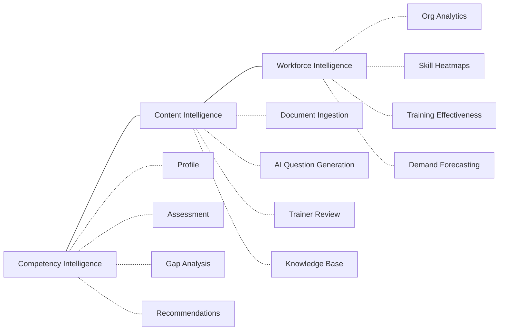
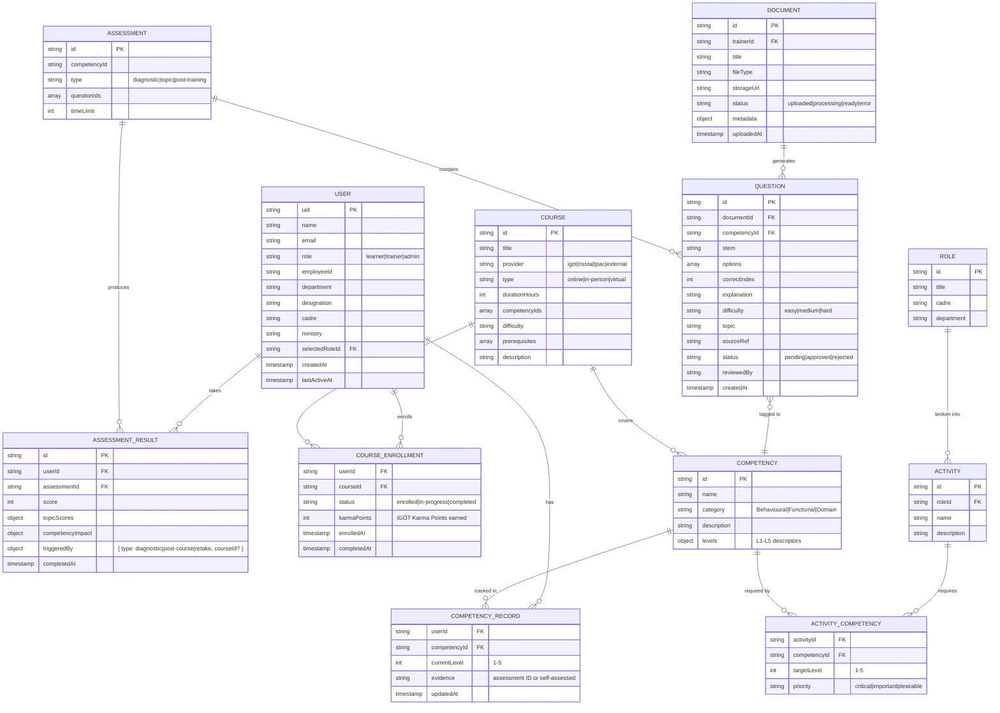
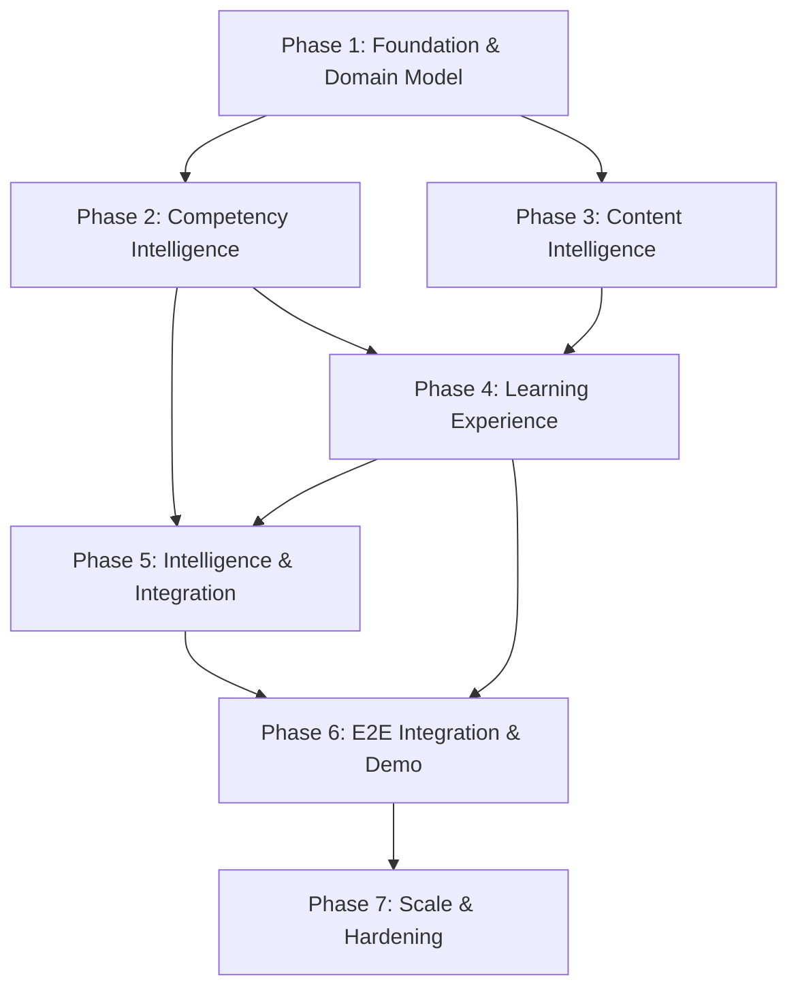

# Revised Master Implementation Plan

> [!IMPORTANT]
> **ARCHITECTURE v2.0 ALIGNMENT NOTICE**:
> This document contains historical context and foundational feature mappings from earlier project iterations. The authoritative, active engineering blueprint for StatVidya is codified in **[PRD.md v2.0](file:///Users/vamsikrishna/Dev%20Projects/i%20proj/SiH/PRD.md)**, **[Architecture.md v2.0](file:///Users/vamsikrishna/Dev%20Projects/i%20proj/SiH/Architecture.md)**, and **[Phases.md v2.0](file:///Users/vamsikrishna/Dev%20Projects/i%20proj/SiH/Phases.md)** based on the Firebase unified cloud topology: **Next.js 15 App Router + Firebase (Firebase Auth, Cloud Firestore, Firebase Storage) + Parichay SSO + Serwist PWA**.

**EduWrap → Workforce Competency Intelligence Platform**

---

## 0. Self-Critique: What Was Wrong With the Previous Plan

Before presenting the revised plan, here are the specific weaknesses I identified in my previous implementation plan and what changes I made:

| #   | Previous Plan Weakness                                                                                                                                                                 | What Changed                                                                                                                                                                                                                        |
| --- | -------------------------------------------------------------------------------------------------------------------------------------------------------------------------------------- | ----------------------------------------------------------------------------------------------------------------------------------------------------------------------------------------------------------------------------------- |
| 1   | **"Delete everything first"** — Phase 0 proposed deleting Rooms, Doubts, Flashcards, Notes immediately. This destroys months of development and ignores repurposing opportunities.     | Replaced with a feature reuse map. Nothing is immediately deleted. Features are classified as KEEP / REPURPOSE / REFACTOR / DEPRECATE / FUTURE. Deprecation happens only _after_ replacement functionality exists.                  |
| 2   | **Two databases for no reason** — Introduced Cloudflare D1 alongside Firestore without justifying why. Created unnecessary data fragmentation.                                         | Firestore is the primary database NOW. Clean service abstractions allow migrating specific workloads (analytics, reporting) to a relational database LATER if query complexity justifies it. D1 is removed from the immediate plan. |
| 3   | **Cloudflare overload** — Added R2, D1, KV, Vectorize, Workers AI, Workers, Calls. Most were premature.                                                                                | Only R2 (file storage) and one Worker (presigned URL generation) are needed NOW. KV, Vectorize, and Calls are FUTURE capabilities with preserved architectural paths.                                                               |
| 4   | **AI treated as "free unlimited"** — Described Workers AI as free LLMs without discussing rate limits (10,000 Neurons/day free tier), model quality tradeoffs, or fallback strategies. | Replaced with a provider-agnostic AI service layer. Gemini Flash as primary (better quality, generous free tier). Workers AI as fallback. Explicit rate limiting, prompt versioning, and caching.                                   |
| 5   | **Fabricated government data** — Proposed creating 20 competencies and 30 courses as if authoritative. No provenance distinction.                                                      | Every domain data item is now explicitly labeled: VERIFIED OFFICIAL, PROPOSED FRAMEWORK, or SYNTHETIC DEMO DATA.                                                                                                                    |
| 6   | **No service architecture** — React components directly calling AI and storage. No domain boundaries.                                                                                  | Introduced 7 domain services with clear interfaces. Components consume services through context providers.                                                                                                                          |
| 7   | **SIH-demo-optimized phases** — 15 phases structured for a demo walkthrough, not for building a sustainable product.                                                                   | Restructured into 7 phases organized by architectural concern: Foundation → Core Platform → Content Intelligence → Learning Experience → Intelligence → Integration → Polish.                                                       |
| 8   | **Unfounded time estimates** — "63–82 hours" with no methodology or uncertainty ranges.                                                                                                | Replaced with complexity ratings, risk levels, and explicit assumptions. Effort ranges reflect honest uncertainty.                                                                                                                  |
| 9   | **Client-side-only security** — `RoleGuard` component is trivially bypassable. No server-side authorization.                                                                           | Added Firestore Security Rules for server-side enforcement. Client-side guards are UI-only; real authorization happens at the data layer.                                                                                           |
| 10  | **No migration strategy** — Jump from old to new with no transition plan.                                                                                                              | Feature deprecation is staged. Old features remain accessible until replacements are built and tested.                                                                                                                              |
| 11  | **iGOT integration hand-waved** — Just "mock it." No research into what's actually available.                                                                                          | Researched: iGOT has NO public API documentation. Adapter pattern with mock mode is correct, but now explicitly states this is a proposed integration design, not confirmed.                                                        |
| 12  | **No testing or observability** — Just "npm run build."                                                                                                                                | Added structured verification: build checks, manual test scripts, demo recording, and error boundary strategy.                                                                                                                      |

---

## 1. Product Vision

> Build a genuinely useful, extensible workforce learning and competency intelligence platform that solves SIH 26101 extremely well while having a credible path to become a much larger real-world product.

**SIH 26101 is the entry point. It is not the boundary.**

iGOT Karmayogi — the nation-scale platform this system integrates with — has crossed **1 crore (10 million) registered users** and serves content in **16 languages**. This platform is not a toy integration exercise: it is a competency intelligence layer designed to sit on top of that national infrastructure, providing the gap analysis, assessment, and content intelligence capabilities that iGOT's course delivery alone does not address.

The platform implements a **closed-loop competency intelligence cycle**, structured around the **FRAC (Framework of Roles, Activities and Competencies)** methodology — one of the Six Pillars of Mission Karmayogi — which deconstructs each government position into Role → Activity → Competency:

```
Profile → Assess → Gap → Recommend → Learn → Practice → Reassess → Update → Repeat
```

This cycle is the product's core value proposition. Every feature either contributes to this loop or supports the people who operate it (trainers, administrators).

### What This Is NOT

- Not another generic LMS
- Not a ChatGPT wrapper
- Not a feature checklist to satisfy SIH judges
- Not a student study app with government labels

### What This IS

- A competency intelligence system that identifies what professionals know and what they need to learn
- A content intelligence pipeline that transforms training materials into assessments
- A workforce intelligence dashboard that gives organizations visibility into collective capability

### Differentiation Strategy

> [!IMPORTANT]
> **The blunt reality**: The obvious interpretation of SIH 26101 — upload training docs → AI generates MCQs → map to competencies → show gaps → recommend iGOT courses → admin dashboard — is what every competing team will converge on independently, because the problem statement basically hands it to you. Executing this well is necessary but not sufficient. "Extremely well-built version of the thing everyone builds" still loses to "the thing nobody else thought of." Polish doesn't differentiate; premise does.

Three levers separate this platform from the 8th AI-MCQ-generator a judge sees that day:

1. **Field personnel, not desk officers (Lever 1)**: The Field Investigator / Primary Enumerator (NSSO FOD) is the numerically largest workforce segment, the one where competency gaps have the most visible cost (bad sampling → bad national statistics), and the one **no other team will build for** because offline-first is harder to build and harder to demo than another chat UI. One PWA-installable, offline-capable, Hindi-first assessment flow beats another fully-built desk-officer dashboard that a dozen other teams will also have.

2. **Training → field outcomes, not self-referential scores (Lever 2)**: The current "impact" chain (assessment score → competency level → readiness index → recommend course → score goes up) is internally consistent but self-referential — it never touches whether training actually improved anything real. Connecting competency levels to simulated survey quality metrics reframes the platform from "another LMS" to "proof that training spending works" — the question MoSPI's Parliamentary committee actually asks.

3. **FRAC grounding, not invented taxonomy (Lever 3)**: Most teams will invent their own "4-pillar skill taxonomy" from scratch because nobody researches Mission Karmayogi's actual methodology in a hackathon sprint. "We didn't invent a taxonomy, we implemented the government's own framework" should be the **first sentence of the pitch** — before a single screen is shown.

> [!WARNING]
> **Build priority rule**: Cut or stub anything generic-and-expected (admin heatmap, full adaptive branching, bilingual toggle everywhere) **before** cutting anything from the three levers above. Judges forgive a rough edge on a familiar feature; they don't forgive a differentiated feature that never got built because time went into MCQ-generator polish.

---

## 2. Product Scope

### Three Pillars



**Pillar 1 — Competency Intelligence** (Learner-facing)
Maps an individual's current capabilities against their role's FRAC-defined Activity → Competency requirements, identifies gaps, and recommends learning pathways.

**Pillar 2 — Content Intelligence** (Trainer-facing)
Transforms official training documents into structured assessments through AI, with human-in-the-loop quality control.

**Pillar 3 — Workforce Intelligence** (Admin-facing)
Provides organizational leaders with visibility into collective workforce capability, training effectiveness, and emerging skill demands.

---

## 3. SIH 26101 Requirements Mapping

Based on verified research of the SIH 26101 problem statement:

| SIH Requirement                              | Verification Status                               | Platform Feature                                                               | Phase       |
| -------------------------------------------- | ------------------------------------------------- | ------------------------------------------------------------------------------ | ----------- |
| AI-powered competency gap identification     | ✅ **VERIFIED** (core SIH requirement)            | Skill Gap Analysis Engine (FRAC-aligned)                                       | Phase 2     |
| Integration with iGOT Karmayogi ecosystem    | ✅ **VERIFIED** (core SIH requirement)            | iGOT Adapter (mock + DSEP interface, Karma Points & APAR tracking, deep links) | Phase 2     |
| Personalized training recommendations        | ✅ **VERIFIED** (core SIH requirement)            | Recommendation Engine + Learning Pathways                                      | Phase 2     |
| Auto-generate MCQs from training materials   | ✅ **VERIFIED** (core SIH requirement)            | AI Document → MCQ Pipeline (single-prompt batch, confidence tagging)           | Phase 3     |
| Focus on India's Official Statistical System | ✅ **VERIFIED** (domain context)                  | MoSPI domain data, ISS/SSS/NSSO roles, NSSTA training curriculum               | Phase 1     |
| Adaptive learning & dynamic difficulty       | ✅ **VERIFIED** (core SIH requirement)            | 3-stage dynamic assessment branching (Medium → Hard/Easy) to determine L1–L5   | Phase 2     |
| Virtual assistance & AI copilot              | ⚠️ **MENTIONED** (SIH mentions virtual assistant) | AI Learning Assistant (5 concrete capabilities, §11a)                          | Phase 2 & 5 |
| Multilingual support (Hindi/English)         | ⚠️ **MENTIONED** (vital for field staff)          | Bilingual UI headers, FRAC competencies & survey questions                     | Phase 1 & 2 |
| Virtual labs for statistical practice        | ⚠️ **MENTIONED** (emerging tech practice)         | Statistical Practice Sandbox (Python / survey data calculation lab)            | Phase 5     |
| Security & Gov SSO (Parichay/MeriPehchaan)   | ⚠️ **MENTIONED** (security & gov standards)       | Firebase Auth + Simulated Parichay (National Jan-Parichay SSO)                 | Phase 1     |
| Workforce analytics & cadre forecasting      | ⚠️ **MENTIONED** (MoSPI capacity building)        | Workforce Intelligence Dashboard + priority training write-back                | Phase 4 & 5 |

> [!IMPORTANT]
> **Confirmed fact**: iGOT Karmayogi does NOT provide public API documentation. No developer portal exists. Integration requires official government authorization via mission.karmayogi@gov.in. For the hackathon, we build an architectural mock adapter that adheres to the **DSEP Protocol / Sunbird standards**, demonstrates Karma Points tracking, and deep-links directly to live iGOT course catalog URLs.

---

## 4. User Personas

### Persona 1: Learner (Government Statistical Official & Field Personnel)

**Who**:

- **Ground Field Personnel ⭐ PRIMARY DEMO PERSONA**: Field Investigator / Primary Enumerator (NSSO Field Operations Division - FOD) conducting PLFS, ASI, ASUSE, and agricultural surveys on CAPI tablets. **This is the numerically largest segment of the statistical workforce** and the population where competency gaps have the most direct, measurable cost (bad sampling technique in the field → bad national statistics → the thing MoSPI is publicly worried about). They work with intermittent connectivity, primarily in Hindi, on tablets — not laptops with steady broadband. MoSPI's own modernization priorities center on CAPI adoption, in-built validation checks, and multilingual interfaces for exactly this population.
- **Central/Desk Officers**: Junior Statistical Officer (JSO), Senior Statistical Officer (SSO), Deputy Director (ISS), System Analyst at MoSPI headquarters, CSO, or State DES.

**Goals**:

- Understand what competencies they need for their specific role per FRAC mapping
- See clearly where their skill gaps are with visual distinction between self-assessed and verified levels
- Receive tailored learning recommendations linked to iGOT Karmayogi with Karma Points tracking
- Take interactive adaptive assessments that measure real competency growth
- View content in Hindi or English depending on their posting and language comfort
- Track their professional development and APAR appraisal readiness over time

**Pain points**:

- No visibility into what skills their cadre or field deployment actually requires
- Generic classroom training that doesn't address their specific field or analytical gaps
- NSSO field investigators receive dense 300-page manuals with little interactive practice
- No way to measure whether training closed their skill gap or improved survey data quality
- Assessment results are static pass/fail marks that do not connect back to learning pathways

### Persona 2: Trainer (Faculty / NSSTA / Domain Expert)

**Who**: Training faculty at NSSTA/TPAC, subject matter experts in statistical methods, senior officials who author training materials.

**Goals**:

- Upload official training documents and manuals
- Generate assessments from their materials efficiently
- Maintain quality control over AI-generated questions
- Track how learners perform on their content
- Build a reusable question bank over time

**Pain points**:

- Creating quality MCQs is extremely time-consuming
- No standardized way to tag questions to competencies
- Can't see if their training material actually closes skill gaps

### Persona 3: Administrator (Ministry / Cadre Manager)

**Who**: Department heads, HR/capacity building managers, MoSPI leadership.

**Goals**:

- See workforce competency levels across the organization
- Identify which departments or roles have critical skill gaps
- Measure whether training programs are effective
- Plan future training investments based on emerging needs

**Pain points**:

- No aggregate view of workforce capabilities
- Can't compare departments or roles
- Training budget decisions are not data-driven

---

## 5. Complete User Journeys

### Learner Journey

```
1. Sign up / Login (Firebase Auth: Email or Google)
      ↓
2. Onboarding
   → Select role: Learner / Trainer / Admin
   → Enter official details (Name, Dept, Designation, Cadre)
   → Select your government role from catalog (e.g., JSO)
   → Self-assess initial competency levels (L1–L5 per competency)
      ↓
3. Dashboard (first view)
   → Workforce Readiness Index (%)
   → Top 3 priority skill gaps
   → Recommended next actions
      ↓
4. Skill Gap Analysis
   → Per-competency: current level vs. required level
   → Gap severity (high/moderate/proficient) — priority-weighted per FRAC activity criticality
   → Visual distinction: 🛡️ assessment-verified levels vs. ✍️ self-assessed levels (different badge/icon)
   → "How to close this gap" CTAs
      ↓
5. Learning Pathways
   → AI-recommended courses sorted by relevance
   → Explainability: "Why this recommendation"
   → Pathway: Foundational → Applied → Capstone
   → Mark courses as in-progress / completed
      ↓
6. Take Assessment
   → Choose competency or take diagnostic
   → Clean focus-mode quiz interface
   → Timer, question navigation
   → "Flag this question" button on each question (quality issue reporting)
      ↓
7. Results & Impact
   → Score + topic-wise breakdown
   → Competency level updates (L2 → L3)
   → Revised gap analysis
   → New recommendations based on updated profile
      ↓
8. Repeat (the loop closes)
```

### Trainer Journey

```
1. Login → Trainer Dashboard
      ↓
2. Upload Document
   → Drag-and-drop PDF/DOCX to R2 storage
   → Document processing status indicator
      ↓
3. Generate Questions
   → Select document → Configure (count, difficulty, competency)
   → AI generates MCQs with progress indicator
      ↓
3a. Competency Validation Check (NEW — Change 7)
   → Generation config shows sanity check:
     "Generated questions reference topics X, Y, Z —
      does this match the competency you selected?"
   → Trainer confirms or adjusts competency tag before full review
      ↓
4. Review Panel
   → Per-question: Approve / Edit / Reject
   → Pre-sorted by AI confidence (low-confidence first)
   → Edit stem, options, answer, explanation, tags
   → Bulk actions
      ↓
5. Publish to Question Bank
   → Questions become available for assessments
      ↓
6. Monitor Performance
   → See how learners perform on their questions
   → Identify problematic questions (high error rate + learner-flagged questions)
```

### Administrator Journey

```
1. Login → Admin Dashboard
      ↓
2. Organization Overview
   → Total officials, average readiness, trend
   → AI-generated narrative summary of top gap trend
      ↓
3. Role/Department Breakdown
   → Basic table view of readiness by role/department
   → Drill-down to individuals
      ↓
4. Actions
   → Flag department for priority training (write-back action)
   → View flagged departments and reasons
```

> [!NOTE]
> **Honest scope for hackathon**: Full Skill Gap Heatmap (departments × competencies matrix), Training Effectiveness (before/after comparisons), and Demand Forecasting are deferred to NEXT. The admin screen at demo is an org overview + AI narrative + one write-back action. If this scope feels too thin, the heatmap is the best stretch goal.

---

## 6. Existing EduWrap Feature Reuse Map

| Feature                                                                                                                                                                                                                                  | Current Purpose                             | Classification | Transformation                                                                                                          | Rationale                                                                                          |
| ---------------------------------------------------------------------------------------------------------------------------------------------------------------------------------------------------------------------------------------- | ------------------------------------------- | -------------- | ----------------------------------------------------------------------------------------------------------------------- | -------------------------------------------------------------------------------------------------- |
| **React 19 + Vite 8 + Tailwind 4**                                                                                                                                                                                                       | Framework & tooling                         | **KEEP**       | No change                                                                                                               | Solid modern stack                                                                                 |
| **Design system** ([index.css](file:///Users/vamsikrishna/Dev%20Projects/i%20proj/EduWrap/src/index.css))                                                                                                                                | Theme tokens, accent system, glassmorphism  | **KEEP**       | Update color palette to be more professional/governmental                                                               | Premium aesthetic is an asset; refine, don't remove                                                |
| **UI Components** (18 components in [ui/](file:///Users/vamsikrishna/Dev%20Projects/i%20proj/EduWrap/src/components/ui))                                                                                                                 | Buttons, Cards, Modals, etc.                | **KEEP**       | Use directly                                                                                                            | Battle-tested, reusable                                                                            |
| **App Shell** ([AppLayout](file:///Users/vamsikrishna/Dev%20Projects/i%20proj/EduWrap/src/layouts/AppLayout.jsx), [AuthLayout](file:///Users/vamsikrishna/Dev%20Projects/i%20proj/EduWrap/src/layouts/AuthLayout.jsx))                   | Sidebar + topbar + responsive               | **KEEP**       | Update navigation items per role                                                                                        | Core layout is solid                                                                               |
| **Firebase Auth** ([UserContext](file:///Users/vamsikrishna/Dev%20Projects/i%20proj/EduWrap/src/contexts/UserContext.jsx))                                                                                                               | Email + Google + GitHub auth                | **KEEP**       | Extend user schema with official profile fields                                                                         | Auth infrastructure works well                                                                     |
| **Firestore layer** ([firestore.js](file:///Users/vamsikrishna/Dev%20Projects/i%20proj/EduWrap/src/firebase/firestore.js))                                                                                                               | CRUD helpers, collection refs, batch writes | **KEEP**       | Add new collection refs, expand helpers                                                                                 | Clean abstraction, easy to extend                                                                  |
| **Settings** ([Settings/](file:///Users/vamsikrishna/Dev%20Projects/i%20proj/EduWrap/src/pages/Settings))                                                                                                                                | Theme, accent, preferences                  | **KEEP**       | Add role-specific settings                                                                                              | Already done, works well                                                                           |
| **Quiz system** ([QuizContext](file:///Users/vamsikrishna/Dev%20Projects/i%20proj/EduWrap/src/contexts/QuizContext.jsx), [Quiz/](file:///Users/vamsikrishna/Dev%20Projects/i%20proj/EduWrap/src/components/Quiz))                        | PDF → MCQ → quiz taking → scoring           | **REPURPOSE**  | Becomes Competency Assessment Engine. Add competency tagging, topic-wise scoring, level promotion logic.                | Core flow (generate → take → score) maps directly.                                                 |
| **Question generator** ([questionGenerator.js](file:///Users/vamsikrishna/Dev%20Projects/i%20proj/EduWrap/src/services/questionGenerator.js))                                                                                            | Rule-based MCQ from PDF text                | **REPURPOSE**  | Keep as offline fallback. Add AI-powered generation as primary path. Wrap both behind a common interface.               | 359 lines of working NLP. Valuable as fallback when AI quota exhausted.                            |
| **PDF service** ([pdfService.js](file:///Users/vamsikrishna/Dev%20Projects/i%20proj/EduWrap/src/services/pdfService.js))                                                                                                                 | PDF text extraction with OCR fallback       | **REPURPOSE**  | Becomes the first stage of the document ingestion pipeline. Add chunking, metadata extraction, section detection.       | Solid extraction + Tesseract OCR. Essential for the content pipeline.                              |
| **File management** ([FileContext](file:///Users/vamsikrishna/Dev%20Projects/i%20proj/EduWrap/src/contexts/FileContext.jsx), [Files.jsx](file:///Users/vamsikrishna/Dev%20Projects/i%20proj/EduWrap/src/pages/Files.jsx))                | Firebase Storage upload/download/manage     | **REPURPOSE**  | Becomes Document Manager for trainer uploads. Swap Firebase Storage → R2 for large files. Keep drag-and-drop UI.        | Upload flow, progress tracking, file cards all reusable.                                           |
| **Dashboard** ([Dashboard.jsx](file:///Users/vamsikrishna/Dev%20Projects/i%20proj/EduWrap/src/pages/Dashboard.jsx), [DashboardContext](file:///Users/vamsikrishna/Dev%20Projects/i%20proj/EduWrap/src/contexts/DashboardContext.jsx))    | Student study metrics                       | **REFACTOR**   | Replace student metrics with competency data. Keep bento-grid layout, stat cards, notification system, task management. | Layout patterns and Firestore listeners are reusable. Data model changes.                          |
| **Profile** ([Profile.jsx](file:///Users/vamsikrishna/Dev%20Projects/i%20proj/EduWrap/src/pages/Profile.jsx), [ProfileComponents/](file:///Users/vamsikrishna/Dev%20Projects/i%20proj/EduWrap/src/pages/ProfileComponents))              | Student gamification profile                | **REFACTOR**   | Official professional profile with competency radar, assessment history, certifications.                                | Page structure reusable. Content changes.                                                          |
| **Landing** ([Landing.jsx](file:///Users/vamsikrishna/Dev%20Projects/i%20proj/EduWrap/src/pages/Landing.jsx))                                                                                                                            | Student SaaS marketing page                 | **REFACTOR**   | Rebrand copy, features, stats for government platform. Keep animations, glassmorphism, structure.                       | 17KB of polished landing page. Change content, not architecture.                                   |
| **Onboarding** ([Onboarding.jsx](file:///Users/vamsikrishna/Dev%20Projects/i%20proj/EduWrap/src/pages/Onboarding.jsx))                                                                                                                   | Student interest selection                  | **REFACTOR**   | Multi-step: role selection → official details → role catalog → initial competency self-assessment.                      | Multi-step stepper pattern reusable.                                                               |
| **Study Rooms** ([Rooms.jsx](file:///Users/vamsikrishna/Dev%20Projects/i%20proj/EduWrap/src/pages/Rooms.jsx), [RoomContext](file:///Users/vamsikrishna/Dev%20Projects/i%20proj/EduWrap/src/contexts/RoomContext.jsx))                    | Discord-like study rooms                    | **DEPRECATE**  | Remove from navigation NOW. Code stays in repo. FUTURE: repurpose as Training Cohorts / Learning Communities.           | 22KB of room management + Firestore integration. Valuable architecture for future cohort learning. |
| **Doubts** ([Doubts.jsx](file:///Users/vamsikrishna/Dev%20Projects/i%20proj/EduWrap/src/pages/Doubts.jsx), [DoubtContext](file:///Users/vamsikrishna/Dev%20Projects/i%20proj/EduWrap/src/contexts/DoubtContext.jsx))                     | Student Q&A forum                           | **DEPRECATE**  | Remove from navigation NOW. FUTURE: repurpose as Expert Q&A / Knowledge Support for officials.                          | Q&A with voting, threading, tagging — useful for a knowledge community feature later.              |
| **Flashcards** ([Flashcards.jsx](file:///Users/vamsikrishna/Dev%20Projects/i%20proj/EduWrap/src/pages/Flashcards.jsx), [FlashcardContext](file:///Users/vamsikrishna/Dev%20Projects/i%20proj/EduWrap/src/contexts/FlashcardContext.jsx)) | Quizlet-style flipper                       | **DEPRECATE**  | Remove from navigation NOW. FUTURE: repurpose as micro-learning / spaced-repetition reinforcement.                      | `generateFlashcards()` function in questionGenerator.js feeds directly into future micro-learning. |
| **Notes** ([Notes.jsx](file:///Users/vamsikrishna/Dev%20Projects/i%20proj/EduWrap/src/pages/Notes.jsx), [NotesContext](file:///Users/vamsikrishna/Dev%20Projects/i%20proj/EduWrap/src/contexts/NotesContext.jsx))                        | Basic notes editor                          | **DEPRECATE**  | Remove from navigation NOW. FUTURE: personal knowledge workspace or study notes during courses.                         | Minimal current implementation (794 bytes). Low cost to keep.                                      |
| **Sandbox** ([Sandbox.jsx](file:///Users/vamsikrishna/Dev%20Projects/i%20proj/EduWrap/src/pages/Sandbox.jsx))                                                                                                                            | Component playground                        | **DEPRECATE**  | Remove from navigation. Keep for development use. FUTURE: could become a statistical practice laboratory.               | Dev tool. No user value currently.                                                                 |
| **Storage service** ([storageService.js](file:///Users/vamsikrishna/Dev%20Projects/i%20proj/EduWrap/src/firebase/storageService.js))                                                                                                     | Firebase Storage upload/download            | **KEEP**       | Continue using for small files (avatars). Large files (PDFs, documents) move to R2.                                     | Firebase Storage is fine for small assets. R2 is better for large documents ($0 egress).           |
| **Seed data** ([seedData.js](file:///Users/vamsikrishna/Dev%20Projects/i%20proj/EduWrap/src/firebase/seedData.js))                                                                                                                       | Demo rooms, doubts, files                   | **REFACTOR**   | Replace student seed data with government-domain seed data: roles, competencies, courses, sample questions.             | Seed function pattern is useful. Content needs replacement.                                        |

> [!IMPORTANT]
> **Migration strategy**: Deprecated features are removed from navigation and routing ONLY. Source files remain in the repository. This means:
>
> - No functionality is destroyed
> - The app continues to build cleanly
> - Features can be re-enabled for repurposing in FUTURE phases
> - Git history preserves everything regardless

---

## 7. Domain Model

### Core Entities



### Provenance Labels

| Entity                                                                | Data Source                                                                                                                                                         | Label                                                                                           |
| --------------------------------------------------------------------- | ------------------------------------------------------------------------------------------------------------------------------------------------------------------- | ----------------------------------------------------------------------------------------------- |
| Competencies (Behavioural/Functional/Domain categories, ~15–20 items) | Categorized per FRAC’s three competency types; specific statistical competencies within Functional/Domain are our own proposal inspired by MoSPI/NSSTA domain areas | **PROPOSED FRAMEWORK** (categories are FRAC-official; individual competencies are our proposal) |
| Competency level descriptors (L1–L5)                                  | Consistent with FRAC’s five-level competency scoring guidance; specific level descriptors are our own proposal                                                      | **PROPOSED METHODOLOGY**                                                                        |
| Government roles (JSO, SSO, etc.)                                     | Based on real Indian Statistical Service designations, but our mapping of Activity → Competency requirements                                                        | **PROPOSED FRAMEWORK** (role names are real; Activity/Competency mappings are our proposal)     |
| FRAC Role → Activity → Competency structure                           | Mirrors official FRAC methodology from Mission Karmayogi                                                                                                            | ✅ **VERIFIED OFFICIAL** (structure); activities/mappings are **PROPOSED FRAMEWORK**            |
| Course catalog (~25 courses)                                          | Fabricated for demonstration purposes                                                                                                                               | **SYNTHETIC DEMO DATA**                                                                         |
| iGOT course data                                                      | No API access available; created to simulate integration                                                                                                            | **SYNTHETIC DEMO DATA**                                                                         |
| Sample questions (~50)                                                | Generated for demo purposes                                                                                                                                         | **SYNTHETIC DEMO DATA**                                                                         |
| Scoring/progression logic                                             | Our own methodology for level promotion                                                                                                                             | **PROPOSED METHODOLOGY**                                                                        |
| Gap severity thresholds                                               | Our defined thresholds combining level delta and activity priority weighting                                                                                        | **PROPOSED METHODOLOGY**                                                                        |
| Recommendation scoring formula                                        | Our weighted multi-signal formula                                                                                                                                   | **PROPOSED METHODOLOGY**                                                                        |

> [!WARNING]
> Every screen displaying domain data must be clear about provenance. Demo/presentation slides should state: "Competency framework follows FRAC’s Behavioural/Functional/Domain categorization and Role → Activity → Competency structure. Specific competencies, level descriptors, and scoring methodology are proposed by our team. Course catalog and iGOT data are simulated for demonstration."

### 7a. FRAC Alignment

**What is FRAC?** FRAC — Framework of Roles, Activities and Competencies — is one of the Six Pillars of Mission Karmayogi, India’s national programme for civil services capacity building. FRAC provides a standardized methodology for deconstructing every government position into three constructs:

1. **Role**: A named government position (e.g., Junior Statistical Officer)
2. **Activity**: A discrete work function performed in that role (e.g., “Conduct large-scale sample surveys,” “Analyze census micro-data”)
3. **Competency**: A specific skill or knowledge area required to perform the activity, classified as:
   - **Behavioural**: Leadership, communication, teamwork, ethics (common across government)
   - **Functional**: Job-family-specific skills (e.g., project management, data governance — shared across statistical roles)
   - **Domain**: Role-specific technical expertise (e.g., survey sampling design, GIS for statistical mapping)

FRAC competencies are further structured under the **ASK model** (Attitude, Skill, Knowledge) and assessed on a five-level proficiency scale.

**How this platform aligns to FRAC:**

| Aspect                | FRAC Official                                              | This Platform                                                                                                                                                                   |
| --------------------- | ---------------------------------------------------------- | ------------------------------------------------------------------------------------------------------------------------------------------------------------------------------- |
| Data model structure  | Role → Activity → Competency (three-construct)             | ✅ Mirrors FRAC: `ROLE` → `ACTIVITY` → `ACTIVITY_COMPETENCY` → `COMPETENCY`                                                                                                     |
| Competency categories | Behavioural, Functional, Domain                            | ✅ Uses FRAC’s three categories; MoSPI statistical competencies sit within Functional (e.g., data governance) and Domain (e.g., survey sampling, GIS)                           |
| Proficiency levels    | Five-level scoring                                         | ✅ L1–L5 scale consistent with FRAC’s five-level guidance; specific level descriptors are our own proposal                                                                      |
| Population method     | Departmental FRACing Team conducts a FRACing exercise      | ⚠️ In demo, our team proposes the role-activity-competency mappings. In real deployment, MoSPI’s own FRACing Team would populate this data through an official FRACing exercise |
| Competency dictionary | Central FRAC dictionary of competencies maintained by iGOT | ⚠️ Demo uses our proposed competencies. Real deployment would sync with iGOT’s official competency dictionary                                                                   |
| Position dictionary   | Central FRAC dictionary of positions                       | ⚠️ Demo uses ISS/SSS designations. Real deployment would reference the official position dictionary                                                                             |

> [!NOTE]
> **Why this alignment matters for SIH judges**: FRAC is the government’s own answer to “how do you define what competencies a role needs?” By structuring our data model to mirror FRAC, we demonstrate that this platform isn’t inventing a parallel framework — it’s building tooling _on top of_ the official methodology. The gap between “demo with proposed data” and “production with real FRAC data” is a data population exercise, not an architectural change.

---

## 8. Architecture

### High-Level Architecture

```
┌─────────────────────────────────────────────────────────────┐
│                     PRESENTATION LAYER                       │
│   React 19 + React Router 7 + Tailwind 4 + Framer Motion   │
│                                                              │
│   Pages: Dashboard | Profile | SkillGap | Pathways |        │
│          Assessment | DocManager | MCQGenerator |            │
│          QuestionBank | AdminAnalytics | Settings            │
│                                                              │
│   Shared: UI Components | Layout | Guards | Charts          │
└────────────────────────┬────────────────────────────────────┘
                         │ React Context Providers
┌────────────────────────┴────────────────────────────────────┐
│                      SERVICE LAYER                           │
│                                                              │
│   CompetencyService   │  Computes gaps, readiness, levels   │
│   AssessmentService   │  Question selection, scoring,       │
│                       │  competency impact                  │
│   RecommendationSvc   │  Course ranking, pathway building   │
│   ContentService      │  Doc ingestion, text extraction,    │
│                       │  chunking                           │
│   AIService           │  Provider abstraction, MCQ gen,     │
│                       │  assistant, prompt management       │
│   StorageService      │  R2 presigned URLs, upload/download │
│   IntegrationService  │  iGOT adapter (mock/live)           │
└────────────────────────┬────────────────────────────────────┘
                         │
┌────────────────────────┴────────────────────────────────────┐
│                       DATA LAYER                             │
│                                                              │
│   Firebase Auth    │  Authentication (Email, Google, SSO)    │
│   Firestore        │  Primary database (profiles, assess-   │
│                    │  ments, questions, courses, analytics)  │
│   Firebase Storage │  Small assets (avatars, thumbnails)     │
│   Cloudflare R2    │  Large documents (PDFs, training mats)  │
│   IndexedDB        │  Client-side cache (extracted text,     │
│   (localforage)    │  offline competency data)               │
└─────────────────────────────────────────────────────────────┘
                         │
┌────────────────────────┴────────────────────────────────────┐
│                    EXTERNAL SERVICES                         │
│                                                              │
│   Cloudflare Worker │  Presigned URL generation for R2      │
│   AI Provider       │  Gemini Flash-class (via GEMINI_MODEL │
│                     │  env var) / Workers AI                │
│                     │  (fallback) via AIService abstraction  │
│   iGOT Karmayogi    │  Mock adapter NOW; live integration   │
│                     │  FUTURE (requires gov credentials)     │
└─────────────────────────────────────────────────────────────┘
```

### Service Layer Design

Each service is a plain JavaScript module exporting functions. Services do NOT directly depend on React. Context providers consume services and expose them to components.

```
src/services/
├── competencyService.js     # Gap computation, readiness index, level promotion
├── assessmentService.js     # Question selection, scoring, topic analysis
├── recommendationService.js # Course ranking, pathway construction
├── contentService.js        # Document processing pipeline orchestration
├── aiService.js             # Provider-agnostic AI abstraction
├── storageService.js        # R2 + Firebase Storage unified interface
├── integrationService.js    # iGOT adapter + future external systems
├── questionGenerator.js     # Enhanced: AI + rule-based fallback
└── pdfService.js            # Enhanced: extraction + chunking + metadata
```

> [!NOTE]
> **Why services and not a backend?** For the hackathon/initial product, serverless functions (Cloudflare Workers) handle the small number of operations that genuinely need server-side execution (presigned URLs, AI inference proxying). Everything else runs client-side. This is intentional: it minimizes infrastructure complexity while the team is small. The service layer's clean interfaces mean any service can be migrated to a server-side API later without changing the presentation layer.

---

## 9. Data Architecture

### Primary Database: Firebase Firestore

**Why Firestore (NOW)**:

- Already integrated and working in the codebase
- Real-time listeners for reactive UI (assessment progress, notifications)
- Document-oriented model fits user profiles and assessment results well
- Firebase Auth integration is seamless
- Generous free tier (50K reads, 20K writes, 20K deletes per day)

**Firestore Collections**:

```
users/
  {uid}/
    → name, email, role, department, designation, cadre, organizationId, ...
    → completedCourses: [courseId, ...]
    → (NO competencyProfile here — lives in protected collection)
    notifications/          (subcollection — already exists)
      {notifId}/
        → message, read, createdAt

competency_records/         (PROTECTED — Worker-only writes)
  {uid}/
    → organizationId
    → competencies: { [competencyId]: { level, evidence, updatedAt } }
    → readinessIndex: number
    → lastAssessmentAt: timestamp
    competency_history/     (subcollection)
      {historyId}/
        → competencyId, oldLevel, newLevel, trigger, triggerRef, date

documents/
  {docId}/
    → trainerId, organizationId, title, fileType, r2Key, status, metadata, competencyTags

questions/
  {questionId}/
    → organizationId, documentId, competencyId, stem, options, correctIndex,
      explanation, difficulty, topic, sourceRef, status, reviewedBy

assessments/
  {assessmentId}/
    → organizationId, type, competencyId, questionIds, timeLimit, createdBy

assessment_results/         (PROTECTED — Worker-only writes)
  {resultId}/
    → organizationId, userId, assessmentId, score, topicScores, competencyImpact,
      triggeredBy: { type: 'diagnostic'|'post-course'|'retake', courseId? },
      completedAt

courses/
  {courseId}/
    → title, provider, type, durationHours, competencyIds, difficulty, prerequisites

enrollments/
  {enrollmentId}/
    → userId, courseId, status, enrolledAt, completedAt
```

### Future Relational Layer (NEXT — NOT NOW)

**When to introduce**: If and when we need:

- Complex aggregation queries across organizations (e.g., "average readiness index by department")
- Multi-table JOINs (e.g., "all officials whose GIS competency is below L3 who haven't enrolled in GIS courses")
- Historical reporting with date-range queries across thousands of records
- Analytics workloads that Firestore handles poorly

**How to introduce without rework**: The service layer abstracts data access. Today, `competencyService.computeGaps()` reads from Firestore. Tomorrow, it could read from a SQL database. The presentation layer never knows.

**Candidate**: Cloudflare D1 (SQLite at edge, free 5GB) or Supabase (Postgres, generous free tier). Evaluate when analytics requirements crystallize.

---

## 10. Storage Architecture

### Large Files: Cloudflare R2

**Upload flow** (presigned URL pattern):

```
Browser                    Cloudflare Worker              R2 Bucket
  │                             │                            │
  │ 1. Request upload URL       │                            │
  │ (authenticated, with        │                            │
  │  file metadata)             │                            │
  │────────────────────────────>│                            │
  │                             │                            │
  │                             │ 2. Validate auth token     │
  │                             │    Check file size/type     │
  │                             │    Generate presigned PUT   │
  │                             │    URL (5 min TTL)          │
  │                             │                            │
  │ 3. Presigned URL returned   │                            │
  │<────────────────────────────│                            │
  │                             │                            │
  │ 4. Direct PUT upload        │                            │
  │─────────────────────────────│───────────────────────────>│
  │                             │                            │
  │ 5. Upload complete          │                            │
  │<────────────────────────────│────────────────────────────│
  │                             │                            │
  │ 6. Confirm upload to        │                            │
  │    Firestore (metadata)     │                            │
  │────────────> Firestore      │                            │
```

**Why this pattern**:

- File bytes never transit through our Worker (no bandwidth costs, no timeout risk)
- Secrets (R2 credentials) stay server-side in the Worker
- Browser uploads directly to R2 with progress tracking
- Worker only handles lightweight auth validation + URL generation

**R2 Bucket Structure**:

```
eduwrap-documents/
├── documents/{trainerId}/{documentId}/original.pdf
├── documents/{trainerId}/{documentId}/metadata.json
└── system/defaults/                   # Default assets if needed
```

**Configuration**:

- CORS: Allow PUT from app domain only
- Content types: `application/pdf`, `application/vnd.openxmlformats-officedocument.*`
- Max file size: 50MB (enforced in Worker before signing)
- Presigned URL TTL: 5 minutes

**Download access**: Worker generates presigned GET URLs (1-hour TTL) for authenticated users.

### Small Files: Firebase Storage (Existing)

Keep [storageService.js](file:///Users/vamsikrishna/Dev%20Projects/i%20proj/EduWrap/src/firebase/storageService.js) for:

- User avatars (small images)
- Thumbnails
- Any assets under 5MB

No changes needed. Already working.

> [!NOTE]
> **R2 is a Phase-3/optional-now decision.** Firebase Storage can carry document uploads through the hackathon demo. R2 is introduced later as an optimization (lower egress cost at $0/GB vs Firebase Storage's charges) once the core loop and AI pipeline are proven. Firebase Storage is the **default path**, not a "temporary fallback" — R2 is the **stretch goal**.

---

## 11. AI Architecture

### Provider-Agnostic AI Service

```js
// src/services/aiService.js — Conceptual interface

const AIService = {
  // Provider management
  activeProvider: 'gemini',  // resolved to specific model via Worker env: GEMINI_MODEL

  // Core operations
  async generateQuestions(documentText, config) { ... },
  async explainConcept(query, context) { ... },
  async recommendActions(userProfile, gaps) { ... },

  // Infrastructure
  async invoke(promptId, variables, options) { ... },
  // options: { provider, model, temperature, maxTokens, cache, retries }
};
```

### Provider Evaluation

| Provider                                                       | Quality                     | Free Tier                     | Rate Limits                  | Best For                                              |
| -------------------------------------------------------------- | --------------------------- | ----------------------------- | ---------------------------- | ----------------------------------------------------- |
| **Gemini Flash-class** (configured via `GEMINI_MODEL` env var) | High                        | 15 RPM, 1M TPM, 1500 RPD free | Generous for development     | **PRIMARY** — MCQ generation, assistant, explanations |
| **Cloudflare Workers AI**                                      | Medium (open-source models) | 10,000 Neurons/day            | Resets daily at midnight UTC | **FALLBACK** — when Gemini quota exhausted            |
| **Gemini Pro-class** (configured via env var)                  | Very High                   | Lower free tier               | More restrictive             | **FUTURE** — complex reasoning tasks                  |

> [!NOTE]
> **Model names are NOT hard-coded.** The specific Gemini model (e.g., `gemini-2.5-flash`, or whatever is current at implementation time) is configured as a Worker environment variable `GEMINI_MODEL`. This allows swapping models without code changes when Google releases new versions or deprecates old ones.

### Decision: Gemini Flash-class as Primary

**Rationale**:

- Better question quality than open-source models (Llama/Mistral) on Workers AI
- Generous free tier (1,500 requests/day)
- Structured output support (JSON mode) reduces parsing errors
- Workers AI becomes the fallback when Gemini is unavailable or quota exhausted
- Specific model version configured via `GEMINI_MODEL` Worker secret — not hard-coded

### AI Proxy Architecture (Server-Side from Day One)

> [!CAUTION]
> **No client-side AI keys.** A leaked API key in a public JS bundle means anyone can burn the 1,500 req/day quota in minutes, or run up costs past free tier. We already need a Cloudflare Worker for R2 presigned URLs — route ALL AI calls through that same Worker. This costs ~2-3 extra hours now versus a painful retrofit later.

```
Browser                    Cloudflare Worker              AI Provider
  │                             │                            │
  │ 1. AI request               │                            │
  │ (auth token + prompt data)  │                            │
  │────────────────────────────>│                            │
  │                             │                            │
  │                             │ 2. Validate Firebase token │
  │                             │    Check per-user rate limit│
  │                             │    Select provider/model   │
  │                             │    Forward to Gemini/WAI   │
  │                             │───────────────────────────>│
  │                             │                            │
  │                             │ 3. Validate response       │
  │                             │    Log usage metrics       │
  │                             │<───────────────────────────│
  │                             │                            │
  │ 4. Validated AI response    │                            │
  │<────────────────────────────│                            │
```

**Why this matters beyond security**:

- **Server-side rate limiting per user** — a client-side token bucket is trivially bypassable (clear IndexedDB)
- **Usage tracking** — know exactly which users consume how many AI requests
- **Cost control** — Worker can enforce daily/monthly limits per user before forwarding
- **Provider switching** — change from Gemini to Workers AI or vice versa without client update
- **Response caching** — Worker can cache identical prompts server-side (KV, FUTURE)

### Prompt Management

```
src/services/ai/
├── aiService.js           # Client-side: formats requests, calls Worker proxy
├── prompts/
│   ├── mcqGeneration.js   # MCQ generation prompt template + schema
│   ├── conceptExplain.js  # Explanation prompt template
│   └── recommendation.js  # Recommendation explanation prompt
└── validation.js          # Client-side output validation (correct JSON, etc.)

worker/
├── index.js               # Cloudflare Worker: R2 presigned URLs + AI proxy
├── ai-router.js           # Provider selection, rate limiting, auth validation
├── providers/
│   ├── gemini.js          # Gemini API calls (model via GEMINI_MODEL env var, key in Worker secrets)
│   └── workers-ai.js      # Workers AI binding (fallback)
└── rate-limiter.js        # Per-user rate limiting (in-memory or KV)
```

Each prompt is versioned and includes:

- System instruction
- User message template with variable placeholders
- Expected output schema (for structured output)
- Validation rules
- Retry/fallback behavior

### Rate Limiting & Caching

- **Server-side rate limiter** (Worker): Per-user request tracking, enforced before forwarding to AI provider
- **Response caching**: Cache MCQ generation results by document hash + config hash (IndexedDB client-side; KV server-side in FUTURE)
- **Graceful degradation**: If AI is unavailable, fall back to rule-based `questionGenerator.js` for MCQ generation
- **Usage observability**: Worker logs request count, latency, provider used, user ID per invocation

### 11a. AI Learning Assistant — Functional Specification

The AI Learning Assistant is not a generic chatbot bolted onto the platform. It is a set of **five concrete, context-grounded capabilities** built on infrastructure already planned elsewhere in this document (AI proxy Worker, `competency_records`, `triggeredBy` field, FRAC-structured data). No new architecture is introduced.

**Capability 1 — Gap-aware conversational assistant** (Phase 5)

Every assistant response is grounded server-side (in the Worker, before calling Gemini) in the learner's actual `competency_records`, their role's FRAC-defined Activity → Competency requirements, and their assessment history. This data is injected into the system prompt so the LLM generates personalized advice, not generic answers. The learner never needs to re-explain their role or skill level — the assistant already knows.

**Capability 2 — Trainer-side AI co-pilot for question quality** (Phase 3)

At MCQ generation time, the AI flags its own low-confidence questions (ambiguous stem, multiple plausible correct answers, explanation doesn't match the selected answer) with a `confidence: high|medium|low` tag. The trainer's Stage 6 review queue is pre-sorted by confidence: low-confidence questions appear first for triage, high-confidence questions can be bulk-approved. This turns review into efficient triage rather than flat approve/reject.

**Capability 3 — Explain-the-gap narrator** (Phase 2)

Each skill gap card gets a one-line AI-generated explanation referencing the specific FRAC Activity and Competency, not just "Level 1 → Level 3." Example: _"The Activity 'Analyze census micro-data' requires 'Python for Data Analysis' at Level 3 — your current assessment-verified level is 1. Recommended: start with 'Python Foundations for Statistical Officers.'"_ This depends on FRAC-structured data (Change 1) being in place.

**Capability 4 — Post-assessment micro-feedback** (Phase 2/5)

After an assessment, AI generates a short paragraph (2–3 sentences) on likely _why_ the learner missed specific topics, based on their actual wrong answers and the question explanations. Each insight is linked to the specific course/document chunk addressing it — not generic praise or criticism. Example: _"You missed 3 questions on stratified sampling design. Your answers suggest confusion between proportional and optimal allocation — Chapter 4 of 'Survey Sampling Methods' covers this distinction. Consider enrolling in 'Advanced Sampling Techniques (NSSTA-202).'"_

**Capability 5 — Admin-facing narrative summaries** (Phase 5)

For the Workforce Intelligence dashboard, AI generates a 2–3 sentence plain-language summary of the biggest gap trend across the organization. Example: _"GIS proficiency across Field Analysts has dropped relative to target — 7 of 12 analysts are below Level 2, and no GIS-related courses have been completed this quarter. Consider prioritizing GIS training for the upcoming cycle."_ This keeps the admin dashboard useful even with sparse/mock data, where a heatmap alone might look empty or uninterpretable.

---

## 12. Document-to-Knowledge Pipeline

### Six-Stage Pipeline

```
┌──────────────┐
│ Stage 1:     │  Trainer uploads PDF/DOCX via R2 presigned URL
│ UPLOAD       │  Metadata saved to Firestore (status: "uploaded")
└──────┬───────┘
       ↓
┌──────────────┐
│ Stage 2:     │  pdfService.js extracts text layer
│ EXTRACTION   │  Falls back to Tesseract.js OCR for scanned pages
│              │  Status: "uploaded" → "extracting" → "extracted"
└──────┬───────┘
       ↓
┌──────────────┐
│ Stage 3:     │  Split text into logical chunks (by section/heading)
│ CHUNKING     │  Preserve section titles, page numbers
│              │  Generate chunk metadata (word count, topic hints)
└──────┬───────┘
       ↓
┌──────────────┐
│ Stage 4:     │  Cache extracted text + chunks in IndexedDB
│ INDEXING     │  Save chunk metadata to Firestore document record
│              │  Status: "extracted" → "ready"
└──────┬───────┘
       ↓
┌──────────────┐
│ Stage 5:     │  AI generates MCQs from selected chunks
│ GENERATION   │  Trainer configures: count, difficulty, competency
│              │  Each question tagged to competency + source ref
└──────┬───────┘
       ↓
┌──────────────┐
│ Stage 5a:    │  Competency validation sanity check (NEW)
│ VALIDATION   │  "Generated Qs reference topics X, Y, Z —
│              │   does this match the competency you selected?"
│              │  Trainer confirms or adjusts before full review
└──────┬───────┘
       ↓
┌──────────────┐
│ Stage 6:     │  Trainer reviews each question
│ REVIEW       │  Pre-sorted by AI confidence (low first)
│              │  Approve / Edit / Reject
│              │  Approved questions → Question Bank
└──────────────┘
```

**Current pipeline coverage** (what already exists):

- Stage 2: [pdfService.js](file:///Users/vamsikrishna/Dev%20Projects/i%20proj/EduWrap/src/services/pdfService.js) — text extraction + OCR ✅
- Stage 4: localforage caching ✅
- Stage 5: [questionGenerator.js](file:///Users/vamsikrishna/Dev%20Projects/i%20proj/EduWrap/src/services/questionGenerator.js) — rule-based generation ✅

**What we need to build**:

- Stage 1: Document upload integration (Firebase Storage default; R2 as stretch goal)
- Stage 3: Text chunking with section awareness
- Stage 5 enhancement: AI-powered generation alongside rule-based
- Stage 5a (NEW): Competency validation sanity check between generation and review
- Stage 6: Trainer review UI with confidence-sorted queue

**FUTURE pipeline extensions** (architectural paths preserved):

- **Embeddings**: Vectorize document chunks for semantic search
- **RAG**: Retrieve relevant chunks when AI assistant answers questions
- **Summaries**: AI-generated document summaries
- **Document Q&A**: Ask questions about specific uploaded documents

---

## 13. iGOT Integration Strategy

### Verified Facts

- iGOT Karmayogi is India's civil service learning platform under Mission Karmayogi
- It has crossed **1 crore (10 million) registered users** and serves content in **16 languages**
- It is built on the open-source **Sunbird/DIKSHA platform** (Scala/Angular/Node.js stack)
- There is a public GitHub organization (**CodeForGoodTech/C4GT**) tracking platform components — this is the most accessible window into iGOT's actual technical architecture
- The ecosystem references a **DSEP Protocol** (Decentralized Skilling and Education Protocol) for data/skill exchange — this is a more plausible real integration surface for a "live mode" than assuming a REST API will simply be handed over
- iGOT's unit of progress tracking is **Karma Points**, increasingly tied to APAR (Annual Performance Appraisal Report) — mock data should use this term, not generic "progress"
- There is **NO public API documentation** and no developer portal
- Access requires official authorization via mission.karmayogi@gov.in
- iGOT is restricted to government officials

### Integration Architecture

```js
// src/services/integrationService.js

const IGOTAdapter = {
  mode: 'mock',  // 'mock' | 'live'

  // Course operations
  async searchCourses(query, filters) { ... },
  async getCourse(courseId) { ... },
  async getCompetencyMapping(courseId) { ... },

  // Progress tracking (Karma Points)
  async getKarmaPoints(userId, courseId) { ... },
  async syncEnrollmentProgress(userId, courseId) { ... },

  // Enrollment operations (future)
  async enrollUser(userId, courseId) { ... },
  async getEnrollmentStatus(userId, courseId) { ... },
  async getCompletionCertificate(userId, courseId) { ... },
};
```

**Mock mode** (NOW): Returns data from `src/data/courseCatalog.js`. All course data is labeled as SYNTHETIC DEMO DATA. Mock enrollments include `karmaPoints` values to demonstrate realistic iGOT progress tracking.

**Live mode** (FUTURE): The most plausible integration surface is **DSEP Protocol** (if adopted by iGOT) or direct Sunbird API calls via C4GT's open-source components — not a custom REST API. When/if government API credentials are obtained, implement real HTTP calls. The adapter interface stays identical — no frontend changes needed.

**Presentation**: The UI should show an "iGOT Karmayogi" section with a clear indicator: "Integration: Demo Mode — connected to local course catalog." This demonstrates the architecture without misrepresenting access.

---

## 14. Security & RBAC Model

### Authentication: Firebase Auth (existing)

- Email/Password + Google OAuth
- Session managed via Firebase SDK
- `onAuthStateChanged` listener in [UserContext](file:///Users/vamsikrishna/Dev%20Projects/i%20proj/EduWrap/src/contexts/UserContext.jsx)
- Future: Add "Login with iGOT SSO" button (placeholder for government SSO)

> [!WARNING]
> **Signup model consideration**: Open self-serve signup is odd for a platform meant for verified government officials. For the demo, open signup is fine. For any real deployment, implement:
>
> - Email domain restrictions (`@gov.in`, `@nic.in`, `@mospi.gov.in`)
> - Invite-only onboarding via admin-generated invite codes
> - Or organization-scoped signup links
>
> This doesn't change the architecture — it's a validation check in the signup flow and Firestore rules.

### Authorization: Two Layers

**Layer 1 — Client-Side Guards (UI only)**:

```jsx
// RoleGuard.jsx — shows/hides UI elements
<RoleGuard roles={["trainer", "admin"]}>
  <DocumentUploader />
</RoleGuard>
```

This is for UX only. It does NOT enforce security.

**Layer 2 — Firestore Security Rules (server-side enforcement)**:

All rules scope by `organizationId` from day one to prevent painful multi-tenant retrofits later:

```
rules_version = '2';
service cloud.firestore {
  match /databases/{database}/documents {

    // Helper: get current user's org
    function userOrg() {
      return get(/databases/$(database)/documents/users/$(request.auth.uid)).data.organizationId;
    }
    function userRole() {
      return get(/databases/$(database)/documents/users/$(request.auth.uid)).data.role;
    }

    // Users can read within their org
    // Users can write their own profile — BUT NOT competency data
    // Competency records live in a SEPARATE protected collection
    match /users/{userId} {
      allow read: if request.auth != null;
      // Allow write to own profile, but block direct writes to competencyProfile
      allow write: if request.auth.uid == userId &&
                     !('competencyProfile' in request.resource.data.diff(resource.data).affectedKeys());
    }

    // PROTECTED: Competency records — learners CANNOT directly modify these
    // Only the Cloudflare Worker (via Admin SDK / service account) writes here
    // Client-side reads are allowed for own records
    match /competency_records/{userId} {
      allow read: if request.auth != null &&
                    (request.auth.uid == userId || userRole() == 'admin') &&
                    resource.data.organizationId == userOrg();
      allow write: if false;
      // ↑ ALL writes go through the Cloudflare Worker, which validates:
      //   - assessment was actually completed (checks assessment_results)
      //   - score calculation is correct
      //   - level promotion follows defined rules
      //   - audit trail is created
    }

    // Questions: org-scoped reads + trainer/admin writes
    match /questions/{questionId} {
      allow read: if request.auth != null &&
                    resource.data.organizationId == userOrg() &&
                    (resource.data.status == 'approved' ||
                     userRole() in ['trainer', 'admin']);
      allow create: if request.auth != null &&
                      userRole() in ['trainer', 'admin'] &&
                      request.resource.data.organizationId == userOrg();
      allow update: if request.auth != null &&
                      userRole() in ['trainer', 'admin'] &&
                      resource.data.organizationId == userOrg();
    }

    // Assessment results: learners can READ their own; CREATION goes through Worker
    match /assessment_results/{resultId} {
      allow read: if request.auth != null &&
                    request.auth.uid == resource.data.userId &&
                    resource.data.organizationId == userOrg();
      // Learners submit answers to the Worker, which:
      //   1. Validates answers against correct answers
      //   2. Computes score (untrusted client can't fabricate scores)
      //   3. Creates assessment_result document
      //   4. Updates competency_records
      //   5. Writes audit log
      allow create, update: if false; // Worker-only via Admin SDK
    }

    // Documents: org-scoped reads, trainer/admin writes
    match /documents/{docId} {
      allow read: if request.auth != null &&
                    resource.data.organizationId == userOrg();
      allow write: if request.auth != null &&
                     userRole() in ['trainer', 'admin'] &&
                     request.resource.data.organizationId == userOrg();
    }

    // Courses: org-scoped reads, admin writes
    match /courses/{courseId} {
      allow read: if request.auth != null &&
                    resource.data.organizationId == userOrg();
      allow write: if request.auth != null &&
                     userRole() == 'admin';
    }

    // Audit logs: append-only, readable by admins within org
    match /audit_log/{logId} {
      allow read: if request.auth != null &&
                    userRole() == 'admin' &&
                    resource.data.organizationId == userOrg();
      allow create: if request.auth != null &&
                      request.resource.data.organizationId == userOrg();
      allow update, delete: if false; // Immutable
    }
  }
}
```

### Role Definitions

| Role      | Access                                                                                        | Description                                     |
| --------- | --------------------------------------------------------------------------------------------- | ----------------------------------------------- |
| `learner` | Own profile, assessments, courses, pathways, AI assistant                                     | Government official using the platform to learn |
| `trainer` | Everything learner has + document upload, MCQ generation, question bank, review, cohort stats | Faculty/expert who creates training content     |
| `admin`   | Everything trainer has + organization analytics, role-competency editing, user management     | Department/ministry manager                     |

---

## 15. NOW / NEXT / FUTURE Feature Roadmap

### NOW (Core — implement immediately)

| Feature                               | Pillar      | SIH Alignment | User Value | Product Value |
| ------------------------------------- | ----------- | ------------- | ---------- | ------------- |
| RBAC (Learner/Trainer/Admin)          | Foundation  | ✅            | ✅         | ✅            |
| Official Profile with competency data | Competency  | ✅            | ✅         | ✅            |
| Competency framework (FRAC-aligned)   | Competency  | ✅            | ✅         | ✅            |
| Skill Gap Analysis Engine             | Competency  | ✅ Core SIH   | ✅         | ✅            |
| Assessment Engine (from Quiz)         | Competency  | ✅            | ✅         | ✅            |
| Competency-level promotion logic      | Competency  | ✅            | ✅         | ✅            |
| Recommendation Engine + Pathways      | Competency  | ✅ Core SIH   | ✅         | ✅            |
| iGOT Adapter (mock mode)              | Integration | ✅ Core SIH   | ⚠️         | ✅            |
| R2 document upload (presigned URLs)   | Content     | ✅            | ✅         | ✅            |
| AI MCQ generation                     | Content     | ✅ Core SIH   | ✅         | ✅            |
| Trainer review panel                  | Content     | ✅            | ✅         | ✅            |
| Question Bank management              | Content     | ✅            | ✅         | ✅            |
| Role-specific dashboards              | Experience  | ✅            | ✅         | ✅            |
| Landing page rebrand                  | Experience  | ✅            | ✅         | ✅            |
| **i18n framework (react-i18next)**    | Foundation  | ✅ Lever 3    | ✅         | ✅            |
| **PWA manifest + service worker**     | Foundation  | ✅ Lever 1    | ✅         | ✅            |
| **Offline assessment flow (field)**   | Experience  | ✅ Lever 1    | ✅         | ✅            |
| **Hindi-first field assessment**      | Competency  | ✅ Lever 1+3  | ✅         | ✅            |
| **Training→outcome correlation**      | Intelligence| ✅ Lever 2    | ✅         | ✅            |

### NEXT (Extension — designed into architecture, implemented after core)

| Feature                                              | Pillar       | Value Assessment                                                             | Phase     |
| ---------------------------------------------------- | ------------ | ---------------------------------------------------------------------------- | --------- |
| AI Gap-aware Conversational Assistant (§11a Cap. 1)  | Experience   | High product value — context-grounded guidance, not a generic chatbot        | Phase 5   |
| AI Admin Narrative Summaries (§11a Cap. 5)           | Intelligence | Keeps admin dashboard useful even with sparse data                           | Phase 5   |
| Workforce Intelligence: Org Overview + Top Gap Trend | Intelligence | Honest admin screen for hackathon. Uses AI narrative + basic aggregate data. | Phase 5   |
| Skill Gap Heatmap                                    | Intelligence | Impressive for demos but requires substantial mock org data. Stretch goal.   | NEXT      |
| Training Effectiveness metrics                       | Intelligence | Meaningful only after real assessment data exists                            | NEXT      |
| Demand Forecasting                                   | Intelligence | Requires longitudinal data not available at demo stage                       | FUTURE    |
| AI Explain-the-gap narrator (§11a Cap. 3)            | Competency   | FRAC-referenced gap explanations on every gap card                           | Phase 2   |
| AI Post-assessment micro-feedback (§11a Cap. 4)      | Competency   | Links missed topics to specific courses/chunks                               | Phase 2/5 |
| AI Trainer question quality co-pilot (§11a Cap. 2)   | Content      | Confidence-sorted review queue                                               | Phase 3   |
| Adaptive difficulty in assessments                   | Competency   | Adjusting question difficulty based on performance                           | NEXT      |
| Document Q&A (ask questions about uploaded PDFs)     | Content      | Leverages existing text extraction pipeline                                  | NEXT      |
| Micro-learning / flashcard reinforcement             | Experience   | Repurposes existing flashcard infrastructure                                 | NEXT      |
| Competency history timeline                          | Competency   | Shows progression over time                                                  | NEXT      |

### FUTURE (Platform capabilities — preserve architectural path)

| Feature                            | Architectural Path                                    |
| ---------------------------------- | ----------------------------------------------------- |
| Training Cohorts / Communities     | Repurpose Rooms infrastructure                        |
| Expert Q&A / Knowledge Support     | Repurpose Doubts infrastructure                       |
| Semantic Search (across documents) | Add embeddings pipeline + vector store                |
| RAG-powered AI Tutor               | Combine embeddings + AI assistant                     |
| ~~Multilingual (Hindi/English)~~   | **PROMOTED to NOW** — i18n framework (Phase 1), Hindi-first field flow (Phase 2) |
| Virtual Statistical Lab (Sandbox)  | Repurpose Sandbox + add code execution                |
| Certifications / Skill Passport    | Extend competency records with verifiable credentials |
| SSO with government identity       | Firebase Custom Auth + SAML/OIDC                      |
| ~~Mobile PWA / Offline Support~~   | **PROMOTED to NOW** — PWA foundation (Phase 1), offline assessment flow (Phase 2) |
| Notifications (push/email)         | Firebase Cloud Messaging                              |
| Organization hierarchy management  | Admin features + multi-tenancy                        |
| Relational analytics database      | Migrate analytics workloads to D1/Supabase            |
| Background document processing     | Cloudflare Queues + Workers                           |
| Audit logging                      | Firestore subcollection per entity                    |

---

## 16. Revised Implementation Phases

### Phase 1 — Foundation, Domain Model & Cloud Infrastructure

> Architecture, domain data, auth enhancement, Worker scaffolding, Cloudflare Pages, RBAC, navigation restructure.

**What we build**:

- [ ] **1.1 Configuration & Frontend Deployment**:
  - [ ] Move Firebase config to `.env` variables (`VITE_FIREBASE_API_KEY`, etc.) + add `.env.example` template. (Environment separation — Firebase client keys are public, security is enforced via Auth + Rules).
  - [ ] Configure **Cloudflare Pages** for continuous deployment: connect GitHub repository, build command `npm run build`, output `dist`. Every push gets an instant preview URL and live production URL (`eduwrap.pages.dev`).
- [ ] **1.2 Cloudflare Worker Scaffolding (Resolves Security Deadlock)**:
  - [ ] Initialize `worker/index.js` and `worker/wrangler.toml` with basic routing and CORS handling.
  - [ ] Configure Firebase Admin SDK service account in Worker (`npx wrangler secret put FIREBASE_SERVICE_ACCOUNT`).
  - [ ] Implement initial Worker endpoint `/api/evaluate-assessment` to securely compute scores and write to `competency_records` and `assessment_results`. _(This eliminates the deadlock where Phase 1 security rules block client writes before Phase 3!)_
- [ ] **1.3 Domain Data Framework (FRAC-Aligned & MoSPI Grounded)**:
  - [ ] Create `src/data/competencies.js`:
    - Structured under FRAC's Behavioural, Functional, and Domain categories (~15–20 competencies with L1–L5 descriptors).
    - MoSPI statistical competencies sit within Functional (e.g., Data Governance, Quality Assurance) and Domain (e.g., Survey Sampling, National Accounts, CAPI Data Collection, GIS). Labeled `⚠️ PROPOSED FRAMEWORK`.
  - [ ] Create `src/data/roles.js`:
    - 6–8 real government designations: Junior Statistical Officer (JSO), Senior Statistical Officer (SSO), Deputy Director (ISS), System Analyst, and **Field Investigator / Data Collector (NSSO FOD)**. Labeled `⚠️ PROPOSED FRAMEWORK`.
  - [ ] Create `src/data/activities.js`:
    - Activities for each role (e.g., "Conduct household sample surveys via CAPI", "Analyze national accounts micro-data") linking to required competencies with priority weights (`critical`, `important`, `desirable`). Labeled `⚠️ PROPOSED FRAMEWORK`.
  - [ ] Create `src/data/courseCatalog.js`:
    - 25 synthetic courses mapped to competencies, complete with **deep links to live iGOT Karmayogi course pages** (`https://igotkarmayogi.gov.in/app/toc/...`) and `karmaPoints` values. Labeled `🟡 SYNTHETIC DEMO DATA`.
  - [ ] Create `src/data/sampleQuestions.js`:
    - ~40 pre-built diagnostic questions across competencies, including bilingual question stems for survey sampling. Labeled `🟡 SYNTHETIC DEMO DATA`.
  - [ ] **i18n Framework Setup (Differentiation Lever 3 — Multilingual as Infrastructure, Not a Toggle)**:
    - Install `react-i18next` + `i18next` + `i18next-browser-languagedetector`.
    - Create `/public/locales/en/common.json` and `/public/locales/hi/common.json` with namespace-based locale files.
    - Wire `i18n.js` initialization into app entry point with language detection and fallback.
    - Translate: navigation labels, role names, competency names, key statistical terms, assessment UI strings.
    - **Architecture reads as "designed for India's 22 scheduled languages"** — not "two hardcoded strings per label." Even i18n-framework-with-two-languages-loaded reads as "designed for scale"; a `translations.js` dictionary reads as "we know judges will ask about this so we did the minimum."
- [ ] **1.4 Database Seeding Script**:
  - [ ] Create `scripts/seed-firestore.js` to batch-populate Firestore collections (`courses/`, `questions/`, `roles/`, `activities/`, `competencies/`) from `src/data/` files in one command (`npm run seed`). Solves the "empty database" problem on fresh clones.
- [ ] **1.5 User & Auth Extension**:
  - [ ] Extend [UserContext](file:///Users/vamsikrishna/Dev%20Projects/i%20proj/EduWrap/src/contexts/UserContext.jsx) schema: add `role` (`learner` | `trainer` | `admin`), `employeeId`, `department`, `designation`, `cadre`, `selectedRoleId`, **`organizationId`** (Day 1 multi-tenancy). _Note: `competencyProfile` is NOT stored on the user doc; UserContext subscribes to `competency_records/{uid}` separately to preserve security._
  - [ ] Add **Simulated Parichay (MeriPehchaan National Gov SSO)** login button with one-click demo personas (e.g., "Login as JSO Amit Sharma", "Login as NSSTA Faculty Dr. Rao").
  - [ ] Add email domain validation in signup: `@gov.in`, `@nic.in`, `@mospi.gov.in` + `DEMO_MODE=true` toggle.
- [ ] **1.6 RBAC & Navigation Restructure**:
  - [ ] Create `src/components/guards/RoleGuard.jsx` for role-based conditional rendering.
  - [ ] Add bilingual toggle button (English / हिंदी) to header navigation.
  - [ ] Update [AppLayout](file:///Users/vamsikrishna/Dev%20Projects/i%20proj/EduWrap/src/layouts/AppLayout.jsx) sidebar with role-conditional navigation (Learner, Trainer, Admin).
  - [ ] Unhook deprecated routes from navigation (Rooms, Doubts, Flashcards, Notes, Sandbox) without deleting source code.
- [ ] **1.7 Data Layer & Security Rules**:
  - [ ] Update [firestore.js](file:///Users/vamsikrishna/Dev%20Projects/i%20proj/EduWrap/src/firebase/firestore.js) with collection refs (`competency_records`, `documents`, `questions`, `assessments`, `assessment_results`, `courses`, `enrollments`, `audit_log`).
  - [ ] Deploy initial `firestore.rules` enforcing `organizationId` scoping, immutable audit logs, and `allow write: if false` on `competency_records` and `assessment_results` (trusted writes route through the Cloudflare Worker).
- [ ] **1.8 Core Services & Pure Functions**:
  - [ ] Create `src/services/competencyService.js`:
    - Priority-weighted gap severity calculation:
      $$\text{severityScore} = (\text{targetLevel} - \text{currentLevel}) \times \text{priorityWeight}$$
      where $\text{critical}=3, \text{important}=2, \text{desirable}=1$.
      ($\text{severityScore} \ge 4 \to \text{HIGH } \text{🔴}, 2\text{--}3 \to \text{MODERATE } \text{⚠️}, \le 1 \to \text{PROFICIENT } \text{✅}$).
    - Workforce Readiness Index computation formula.
    - Level promotion threshold calculation.
  - [ ] Create `src/services/auditService.js` (immutable append-only audit logger to `audit_log`).
- [ ] **1.9 Testing & Quality Gates**:
  - [ ] Set up Vitest (`vitest.config.js`).
  - [ ] Write 3 unit smoke tests in `tests/competencyService.test.js`:
    1. Verify priority weighting: $\Delta=1$ on a critical competency ranks higher than $\Delta=2$ on a desirable competency.
    2. Verify readiness index returns 100% when all competencies meet or exceed targets.
    3. Verify level promotion thresholds trigger only on qualifying scores.
  - [ ] Run `npm test` (all pass), `npx eslint . --quiet` (0 errors), `npm run build` (clean build).
- [ ] **1.10 PWA Foundation (Differentiation Lever 1 — Foundation)**:
  - [ ] Add `manifest.json` with installability metadata (name: "StatVidya", short_name: "StatVidya", start_url: "/", display: "standalone", theme_color, icons).
  - [ ] Register a basic service worker (via Vite PWA plugin or manual `sw.js`) that caches the app shell.
  - [ ] Assessment content caching deferred to Phase 2 — this phase establishes installability only.
  - [ ] Verify: app is installable on Chrome/Edge (shows "Install app" prompt).

**Acceptance criteria**:

- User can sign in with Email, Google, or one-click **Parichay Simulated Gov SSO** (pre-loaded demo personas).
- i18n framework (`react-i18next`) loads English and Hindi locales; `useTranslation()` hook works; language switch toggles navigation labels.
- Sidebar reflects role-appropriate navigation for Learner, Trainer, and Admin.
- Cloudflare Pages is connected and builds the app automatically on git push to a live `.pages.dev` URL.
- Cloudflare Worker responds to ping and holds the Admin SDK connection to Firestore.
- Database seeding script populates Firestore collections cleanly without errors.
- Firestore security rules protect `competency_records` and enforce `organizationId` scoping.
- Deprecated routes are removed from the active sidebar while preserving source files.
- App is installable as a PWA (Chrome "Install app" prompt appears).
- `npm test` passes 100% of unit smoke tests.
- `npx eslint . --quiet` returns 0 errors; `npm run build` succeeds in <5 seconds.

**Complexity**: High  
**Risk**: Medium — mitigated by moving Worker scaffolding and seeding script into Phase 1.  
**Dependencies**: Cloudflare account, Firebase Blaze upgrade (free with $0 budget alert).

---

### Phase 2 — Competency Intelligence & Adaptive Assessment (Core Loop)

> Profile, priority-weighted gap analysis, adaptive assessment engine, recommendations, iGOT integration.

**What we build**:

- [ ] Rebuild [Profile.jsx](file:///Users/vamsikrishna/Dev%20Projects/i%20proj/EduWrap/src/pages/Profile.jsx):
  - Official statistical workforce profile with custom SVG Competency Radar Chart.
  - Visual distinction: 🛡️ assessment-verified levels vs ✍️ self-assessed levels.
  - **iGOT Karma Points counter** and **APAR Appraisal Milestone gauge** (e.g., "450 / 500 Karma Points — APAR Goal On Track 🟢").
  - Historical competency growth timeline.
- [ ] Create `src/pages/SkillGap.jsx`:
  - Gap overview dashboard with per-competency cards referencing FRAC Role $\to$ Activity requirements.
  - Priority matrix weighted by activity criticality ($\Delta \times \text{priorityWeight}$).
  - AI "Explain-the-gap" narrator (Capability 3, §11a) referencing specific MoSPI activities.
- [ ] Rebuild [QuizContext.jsx](file:///Users/vamsikrishna/Dev%20Projects/i%20proj/EduWrap/src/contexts/QuizContext.jsx) $\to$ `AssessmentContext.jsx`:
  - Support for **Adaptive Item Branching**: Assessment engine starts at Medium difficulty; dynamically branches to Hard (if answer is correct) or Easy (if incorrect) to pinpoint exact L1–L5 level with fewer questions.
  - Bilingual question rendering (toggle between English and Hindi stems for survey sampling questions).
  - Focus-mode UI, timer, question navigation, and "Flag this question" button.
- [ ] Create `src/services/assessmentService.js`:
  - 3-stage adaptive difficulty branching logic.
  - Topic-wise breakdown and competency level promotion computation.
  - Post-assessment submission to the Cloudflare Worker `/api/evaluate-assessment` (which verifies answers, writes to `assessment_results`, updates `competency_records`, and records audit events).
- [ ] Create `src/services/recommendationService.js`:
  - Multi-signal course scoring ($\text{gap severity} \times 0.4 + \text{role priority} \times 0.3 + \text{difficulty match} \times 0.2 + \text{prerequisite readiness} \times 0.1$).
  - Pathway construction with explainability strings.
- [ ] Create `src/pages/LearningPathways.jsx`:
  - Recommended courses ranked by gap severity, pathway timeline, and "Why Recommended" cards.
  - **Direct deep links on course cards** pointing to live iGOT Karmayogi course pages (`https://igotkarmayogi.gov.in/app/toc/...`).
- [ ] Create `src/services/integrationService.js`:
  - iGOT Adapter (mock mode reading from `src/data/courseCatalog.js` with DSEP Protocol-compliant payload interface).
  - Progress sync and Karma Points calculation.
- [ ] Add outcome tracking mechanism: `triggeredBy: { type: 'diagnostic'|'post-course'|'retake', courseId? }` to support Phase 5 training effectiveness metrics.
- [ ] AI post-assessment micro-feedback (Capability 4, §11a): short paragraph diagnosing why questions were missed, linked to specific recommended courses.
- [ ] **Vitest Unit Test Suite**: test priority-weighted gap computation, adaptive branching logic, level promotion thresholds, and recommendation rankings.
- [ ] **2.x Offline Assessment Flow ⭐ DIFFERENTIATION LEVER 1**:
  - [ ] Create `src/services/offlineService.js`:
    - `cacheAssessmentContent(assessmentId)` — pre-cache questions + options to IndexedDB before going to field.
    - `submitOfflineResult(result)` — queue completed assessment result to IndexedDB pending sync.
    - `syncPendingResults()` — flush queue to Cloudflare Worker `/api/evaluate-assessment` on reconnect.
    - `getOfflineStatus()` — returns `{ isOnline, pendingCount, lastSyncAt }` for UI indicator.
  - [ ] Service worker caches assessment-taking route (`/assessment/*`) and pre-fetched question data.
  - [ ] Add offline status indicator in assessment UI: 🟢 online / 🟠 cached-offline / "परिणाम कनेक्शन मिलने पर सिंक होंगे" (results will sync when connected).
  - [ ] Test protocol: browser in airplane mode → complete assessment → reconnect → verify sync to Worker → competency record updates correctly.
  - [ ] Scope honesty label in UI: _"Offline mode: implemented for assessment-taking. Full content sync: architectural path shown."_
- [ ] **2.y Hindi-First Field Assessment ⭐ DIFFERENTIATION LEVERS 1+3**:
  - [ ] Assessment questions include `stem_hi` and `stem_en` fields (pre-authored bilingual content, not runtime machine translation).
  - [ ] Field Investigator persona defaults to Hindi locale on login (via `i18next-browser-languagedetector` + user profile `preferredLanguage`).
  - [ ] Assessment UI renders Hindi stems by default for FI role, with visible toggle to English.
  - [ ] Create at least 10 sample questions with authentic Hindi stems for the survey sampling domain in `sampleQuestions.js`.

**Acceptance criteria**:

- Learner sees their competency profile with verified (🛡️) vs self-assessed (✍️) badges.
- Karma Points and APAR readiness are clearly displayed on the profile and dashboard.
- Skill gap page orders gaps by FRAC activity criticality ($\Delta \times \text{priorityWeight}$).
- **Adaptive assessment works**: Question difficulty dynamically adapts based on learner answers to calibrate proficiency level (L1–L5).
- Bilingual toggle switches survey questions between English and Hindi.
- Learner can flag ambiguous questions with the "Flag Question" button.
- Completing an assessment routes through Worker and successfully updates `competency_records` in Firestore.
- Learning pathways display ranked courses with direct links to iGOT Karmayogi and "Why Recommended" explainability cards.
- `npm test` passes all unit tests for gap calculations and adaptive branching.
- **⭐ Offline assessment works**: complete assessment in airplane mode → reconnect → results sync → competency record updates. Offline indicator visible throughout.
- **⭐ Hindi-first**: Field Investigator persona loads assessment in Hindi by default; toggle to English works; at least 10 questions have Hindi stems.

**Complexity**: High  
**Risk**: Medium  
**Dependencies**: Phase 1

---

### Phase 3 — Content Intelligence (AI Pipeline & Trainer Workflow)

> Document upload, batch AI MCQ generation, trainer review queue, Question Bank.

**What we build**:

- [ ] Cloudflare Worker storage endpoint for presigned upload URLs (Firebase Storage as default; Cloudflare R2 as stretch goal for $0 egress costs).
- [ ] Enhance `worker/index.js` and `worker/ai-router.js` with Gemini API proxy routing (model dynamic via `GEMINI_MODEL` env var, secret key stored in Wrangler).
- [ ] Rebuild [Files.jsx](file:///Users/vamsikrishna/Dev%20Projects/i%20proj/EduWrap/src/pages/Files.jsx) $\to$ `DocumentManager.jsx`:
  - Trainer document upload with progress indicator.
  - **Guard against client memory freeze**: Enforce **"Page Range Selection (Max 15 pages)"** or chapter-based extraction for large MoSPI manuals.
- [ ] Enhance [pdfService.js](file:///Users/vamsikrishna/Dev%20Projects/i%20proj/EduWrap/src/services/pdfService.js):
  - Section-aware text chunking with heading detection and metadata extraction.
  - Graceful fallback for non-OCR documents.
- [ ] Create `src/services/ai/aiService.js`: client-side interface communicating exclusively with Worker AI proxy.
- [ ] Create structured prompt `worker/prompts/mcqGeneration.js`:
  - **Rate-limit protection**: Mandate **single-prompt batch generation** (generate 10–15 MCQs in one JSON array payload) to strictly respect the Gemini 15 RPM free tier limit.
  - JSON schema enforcement (stem, options, correctIndex, explanation, difficulty, competencyTag, confidence).
- [ ] **AI question quality co-pilot** (Capability 2, §11a): AI tags its own output with `confidence: high|medium|low`.
- [ ] **Stage 5a Competency Validation Check**: intermediate prompt screen ("Generated questions reference topics X, Y, Z — does this match the competency you selected?") before opening review queue.
- [ ] Create `src/pages/MCQGenerator.jsx`:
  - Document selection $\to$ generation configuration $\to$ AI generation progress $\to$ review queue pre-sorted by confidence (low-confidence first for triage).
  - Trainer can approve, edit, or reject questions.
- [ ] Create `src/pages/QuestionBank.jsx`:
  - Searchable, filterable question repository categorized by FRAC competency and difficulty.
  - Approved questions in Question Bank automatically become available to the Phase 2 assessment engine.
- [ ] **AI-Content Audit Trail**: Record generation timestamp, prompt version, trainer approval/edit actions to Firestore `audit_log`.

**Acceptance criteria**:

- Trainer can upload a PDF with a page range selector (preventing browser freezes on 200-page manuals).
- AI generates 10–15 MCQs in a single batch request via Cloudflare Worker proxy without exceeding the 15 RPM limit.
- AI questions include `confidence` tags; review queue displays low-confidence questions first.
- Trainer validates competency match in Stage 5a before full review.
- Approved questions save directly to Firestore `questions/` collection and immediately populate the Question Bank.
- Assessments in Phase 2 dynamically draw newly approved questions from the Question Bank.
- Audit log records all AI question generations, approvals, edits, and rejections.
- Rule-based generator remains available as an automatic fallback if AI service is unreachable.

**Complexity**: Very High  
**Risk**: High — AI integration, R2 setup, CORS configuration are all potential blockers  
**Dependencies**: Phase 1 (RBAC, Firestore collections). Can run in parallel with Phase 2.

---

### Phase 4 — Learning Experience & Dashboards

> Role-specific dashboards, landing rebrand, onboarding polish.

**What we build**:

- [ ] Rebuild [Dashboard.jsx](file:///Users/vamsikrishna/Dev%20Projects/i%20proj/EduWrap/src/pages/Dashboard.jsx) + [DashboardContext](file:///Users/vamsikrishna/Dev%20Projects/i%20proj/EduWrap/src/contexts/DashboardContext.jsx): role-specific views
  - Learner: readiness ring, priority gaps, active courses, recent assessments
  - Trainer: upload stats, review queue, question bank health
  - Admin: org overview (with mock aggregate data)
- [ ] Rebrand [Landing.jsx](file:///Users/vamsikrishna/Dev%20Projects/i%20proj/EduWrap/src/pages/Landing.jsx): government platform copy, feature cards matching actual capabilities, professional aesthetics
- [ ] Update [Login.jsx](file:///Users/vamsikrishna/Dev%20Projects/i%20proj/EduWrap/src/pages/Login.jsx) / [Signup.jsx](file:///Users/vamsikrishna/Dev%20Projects/i%20proj/EduWrap/src/pages/Signup.jsx): branding, "iGOT SSO" placeholder button
- [ ] Update [index.html](file:///Users/vamsikrishna/Dev%20Projects/i%20proj/EduWrap/index.html): title, meta, favicon
- [ ] Create chart components: `RadarChart.jsx` (competency spider), `HorizontalBar.jsx` (gap distribution), `ProgressRing.jsx` (readiness %)

**Acceptance criteria**:

- Each role sees a relevant dashboard on login
- Landing page clearly communicates the platform's value proposition for government workforce learning
- Auth pages have professional government-platform branding
- Dashboard data is driven by real competency/assessment data (not hardcoded mocks)
- **Self-assessed vs. assessment-verified competency levels are visually distinct** on dashboard and profile views

**Complexity**: Medium  
**Risk**: Low — mostly UI work building on existing patterns  
**Dependencies**: Phase 2 (competency data for dashboards), Phase 3 (trainer data)

---

### Phase 5 — Intelligence & Integration (NEXT)

> Workforce intelligence (honest scope), AI assistant, admin actions.

**What we build**:

- [ ] Create `src/pages/AdminAnalytics.jsx`: **single, honest admin screen** for the hackathon:
  - Organization overview: total officials onboarded, average readiness index, trend arrow
  - Top gap trend: AI-generated 2–3 sentence narrative summary (Capability 5, §11a) — e.g., _"GIS proficiency across Field Analysts has dropped relative to target"_
  - Basic role/department breakdown table (not a full heatmap — see NEXT scope below)
- [ ] Create AI Learning Assistant (Capability 1, §11a) — floating panel or dedicated page:
  - Chat interface where every response is **grounded in the learner's actual data**: `competency_records`, role's FRAC Activity → Competency requirements, assessment history — injected server-side into system prompt
  - Suggested question chips: "What am I weakest in?", "Why was this recommended?", "What should I study next?"
  - Provider: same AI service (Gemini Flash via Worker proxy)
- [ ] Create `src/services/ai/prompts/assistant.js`: assistant prompt with user context injection
- [ ] Create `src/services/ai/prompts/narrativeSummary.js`: admin narrative summary prompt
- [ ] Add competency history tracking (Firestore subcollection on user)
- [ ] **Admin write-back action**: "Flag department for priority training" button that writes a `trainingPriority: { flagged: true, reason, flaggedBy, flaggedAt }` field to the department/role record — giving admins one concrete action beyond viewing data
- [ ] **5.x Training → Outcome Correlation Dashboard ⭐ DIFFERENTIATION LEVER 2**:
  - [ ] Create `src/data/outcomeSimulation.js`: synthetic correlation dataset mapping officer competency levels to simulated survey quality scores. Every data point labeled `SYNTHETIC DEMO DATA — simulates e-SIGMA QA metric correlation`. Include methodology note: _"Linear regression on synthetic data. Real implementation requires e-SIGMA API access."_
  - [ ] Create `src/components/charts/OutcomeCorrelation.jsx`: scatter plot with trend line showing competency level (X-axis, L1–L5) vs. simulated survey submission quality score (Y-axis). Prominent `SIMULATED` watermark.
  - [ ] Dashboard panel titled **"Training Impact: Simulated Correlation"** with narrative: _"Officers who scored ≥L3 in Non-Sampling Error Control produced 62% fewer data quality flags in simulated survey submissions."_
  - [ ] **This chart reframes the entire platform pitch**: from "another LMS" to "we're measuring whether training actually works." The question Parliament's Standing Committee asks MoSPI is not "how many courses did officers take?" but "did the training improve statistical output?" This chart is the beginning of an answer.
  - [ ] Provenance: data points are `🟡 SYNTHETIC DEMO DATA`. Chart label: _"Simulated: what this dashboard computes once connected to real survey QA metrics from e-SIGMA."_

**Explicitly deferred to NEXT** (not in Phase 5 scope):

- Skill Gap Heatmap (`Heatmap.jsx`) — impressive but requires substantial mock org data to look good. Stretch goal if time permits.
- Training Effectiveness metrics — meaningful only after real pre/post assessment data exists
- Demand Forecasting — requires longitudinal data not available at demo stage

**Acceptance criteria**:

- Admin sees organization overview with aggregate stats (mock data, clearly labeled)
- AI narrative summary provides a plain-language description of the top gap trend — useful even with sparse data
- Admin can flag a department/role for priority training (write-back action)
- AI assistant answers context-aware questions grounded in the learner's actual profile, gaps, and assessment history
- Competency history shows progression over time
- **⭐ Training→Outcome correlation chart** displays scatter plot with trend line using clearly-labeled synthetic data, methodology note, and e-SIGMA integration path.

**Complexity**: Medium-High  
**Risk**: Medium — AI assistant quality depends on prompt engineering; admin screen depends on aggregate mock data  
**Dependencies**: Phase 2 + Phase 4

---

### Phase 6 — End-to-End Integration & Demo

> Wire the complete golden path, test, polish.

**What we build**:

- [ ] End-to-end integration testing of the closed loop
- [ ] Demo script walkthrough (see §20)
- [ ] Edge cases: empty states, error boundaries, loading skeletons
- [ ] Responsive audit: desktop (primary), tablet, mobile
- [ ] Performance: code splitting, lazy loading verification
- [ ] Accessibility: keyboard nav, focus management, ARIA labels on interactive elements
- [ ] Remove console.logs, debug code
- [ ] Verify Firestore security rules
- [ ] Record demo video of the golden path

**Acceptance criteria**:

- The complete golden path (§20) works without errors
- Every page has loading and empty states
- Build produces zero errors/warnings
- Demo video is recorded and ready

**Complexity**: Medium  
**Risk**: Low — integration issues surface here but individual components are built  
**Dependencies**: All previous phases

---

### Phase 7 — Scale & Hardening (if time permits)

> Production readiness concerns.

- [ ] Error reporting (client-side error boundaries + logging)
- [ ] AI response caching (Worker-side KV by prompt hash)
- [ ] Firestore composite indexes for common queries
- [ ] Bundle size optimization
- [ ] PWA manifest + service worker (for offline profile viewing)
- [ ] Firestore backup/export schedule (manual or automated via Firebase Admin SDK)
- [ ] Dev/staging/prod environment separation (separate Firebase projects per env)
- [ ] CI/CD pipeline (GitHub Actions: lint → test → build → deploy preview)

> [!NOTE]
> Audit logging and AI rate limiting are no longer in Phase 7 — they were pulled into Phase 1 and Phase 3 respectively, as recommended by review.

**Complexity**: Medium  
**Risk**: Low — incremental improvements  
**Dependencies**: Phase 6

---

## 17. Dependencies



**Critical path**: Phase 1 → Phase 2 → Phase 4 → Phase 6

**Parallelizable**: Phase 2 and Phase 3 can run concurrently after Phase 1. If working with a team:

- **Developer A**: Phase 2 (competency loop)
- **Developer B**: Phase 3 (content pipeline)
- **Together**: Phase 4 → 5 → 6

---

## 18. Risks

| Risk                                                              | Likelihood           | Impact | Mitigation                                                                                                                                                                                                                                                                                                                                                                                                             |
| ----------------------------------------------------------------- | -------------------- | ------ | ---------------------------------------------------------------------------------------------------------------------------------------------------------------------------------------------------------------------------------------------------------------------------------------------------------------------------------------------------------------------------------------------------------------------- |
| Gemini API rate limits hit during demo                            | Medium               | High   | Workers AI fallback + rule-based questionGenerator.js as second fallback. Cache AI responses. Server-side rate limiting tracks usage.                                                                                                                                                                                                                                                                                  |
| R2/Worker setup takes longer than expected (CORS, presigned URLs) | Medium               | Medium | Firebase Storage is the default document upload path. R2 is a stretch goal — introduce only after core loop is working. See §10 note.                                                                                                                                                                                                                                                                                  |
| Competency domain model is wrong/incomplete                       | Medium               | Medium | Keep the model simple initially. 15 competencies, not 50. Iterate based on feedback. Outcome tracking (Phase 2) gives data to validate whether the model means anything.                                                                                                                                                                                                                                               |
| Firestore free tier limits during heavy demo                      | Low                  | Medium | Firestore free tier is generous (50K reads/day). Unlikely to hit during demo.                                                                                                                                                                                                                                                                                                                                          |
| AI generates poor-quality MCQs                                    | Medium               | Medium | Trainer review panel catches bad questions. Rule-based fallback for consistent (if simpler) output.                                                                                                                                                                                                                                                                                                                    |
| iGOT integration questioned by judges                             | Medium               | Medium | Clearly demonstrate the adapter pattern. Show mock → live mode switch. Explain that live mode requires government credentials.                                                                                                                                                                                                                                                                                         |
| Scope creep from "just one more feature"                          | High                 | High   | Strict NOW/NEXT/FUTURE discipline. Nothing from NEXT/FUTURE enters current sprint. **Explicit reminder**: deprecated features (Rooms, Doubts, Flashcards, Notes) and their FUTURE repurposing ideas must NOT be pulled into NOW/NEXT under any circumstance before Phase 6 is demo-ready. These four features are the most likely source of scope creep.                                                               |
| **R2 integration timing**                                         | Medium               | Medium | R2 is a stretch goal, not a Phase 3 blocker. Firebase Storage is the default document upload path for the hackathon. Introduce R2 only after the core loop (Phase 2) and AI pipeline (Phase 3) are proven. If R2/Worker setup takes longer than expected (CORS, presigned URLs), stay on Firebase Storage.                                                                                                             |
| Firebase config hard-coded in source                              | Already exists       | Low    | Move to .env for configuration management (env separation, prevent accidental commits). Note: Firebase web API keys are NOT secrets — they identify the project. Real security is Firestore Rules + Auth. Add HTTP referrer restrictions in Firebase Console.                                                                                                                                                          |
| **Data localization requirements**                                | Medium (post-SIH)    | High   | Government platforms handling official employee data in India often require hosting on MeitY-empanelled infrastructure. Firebase/Firestore and Cloudflare R2 are NOT typically empanelled. For SIH demo this is acceptable. For real deployment, evaluate: self-hosted Firestore alternative (e.g., Supabase on Indian cloud), or MeitY-empanelled cloud (NIC/GovCloud). Service abstractions make migration feasible. |
| **Scoring methodology has no external validation**                | Medium               | Medium | Our readiness index, gap severity, and level promotion rules are self-invented. Without checking against real training outcomes, this is a plausible-looking number generator, not intelligence. Outcome tracking mechanism (Phase 2) is the first step; eventual NSSTA/MoSPI expert review is necessary.                                                                                                              |
| **No sustainability model post-SIH**                              | High (if continuing) | High   | See §26. Free tiers cover the demo. Real deployment needs a funding/contract plan.                                                                                                                                                                                                                                                                                                                                     |

---

## 19. Technical Decisions & Alternatives Considered

| Decision                 | Chosen                                          | Alternative Considered             | Why                                                                                                                                                                    |
| ------------------------ | ----------------------------------------------- | ---------------------------------- | ---------------------------------------------------------------------------------------------------------------------------------------------------------------------- |
| Primary database         | Firestore                                       | Cloudflare D1, Supabase            | Already integrated; real-time listeners; seamless Firebase Auth. D1 adds complexity with no immediate benefit. Service abstraction allows migration later.             |
| Large file storage       | Cloudflare R2                                   | Firebase Storage, Supabase Storage | $0 egress, 10GB free. Firebase Storage charges for downloads. Critical for PDF-heavy workload.                                                                         |
| AI provider              | Gemini Flash-class (via `GEMINI_MODEL` env var) | Workers AI only, OpenAI            | Better quality than open-source models. Free tier more generous (1500 RPD vs 10K neurons/day). Workers AI as fallback. Model version configurable, not hard-coded.     |
| AI integration           | Server-side via Cloudflare Worker               | Direct from browser (API key)      | No client-side key exposure. Server-side rate limiting per user. Usage tracking. Provider switching without client update. ~2-3h extra setup, avoids painful retrofit. |
| Upload pattern           | R2 presigned URLs                               | Worker proxy upload                | No file bytes through Worker = no timeouts, no bandwidth costs. Presigned URL is the industry-standard pattern.                                                        |
| Feature removal strategy | Deprecate (hide from nav)                       | Delete files immediately           | Preserves months of work. Features can be repurposed later. Zero risk.                                                                                                 |
| State management         | React Context + services                        | Redux, Zustand, Jotai              | Already established in codebase. 9 contexts working. No reason to add a dependency.                                                                                    |
| Charts/visualizations    | Custom SVG + Framer Motion                      | Chart.js, Recharts, D3             | Fewer dependencies. Radar chart and heatmap are not complex enough to justify a library. Matches existing animation system.                                            |
| CSS framework            | Tailwind 4 (keep)                               | Switch to vanilla CSS              | Already deeply integrated with custom design tokens. Migration would be massive rework for no benefit.                                                                 |

---

## 20. Demo / Golden Path

> [!IMPORTANT]
> **The demo script is the actual product, more than the codebase is.** Scenes 1 and 3 are what the judge hasn't seen before. The AI-MCQ pipeline (Scene 4) is necessary infrastructure, not the headline. Open the pitch with: _"We didn't invent a taxonomy — we implemented the government's own FRAC framework."_

The end-to-end demo tells a single, coherent story that demonstrates the closed loop — but **leads with what differentiates**, not with what's expected:

### Scene 1: Field Investigator in the Field ⭐ THE DIFFERENTIATOR (2.5 min)

1. Open the platform on a **tablet/mobile viewport** — "This is built for the 60% of MoSPI's workforce that works in the field, not at a desk"
2. **Install as PWA** — show the "Install app" prompt, demonstrate installability
3. Sign in via one-click **Parichay (Simulated Gov SSO)** as **Field Investigator Priya Kumari (NSSO FOD, Bihar)**
4. Interface loads **in Hindi by default** — navigation, competency names, assessment UI all in Hindi
5. Show pre-cached assessment for "सर्वेक्षण प्रतिचयन एवं क्षेत्र अनुमान" (Survey Sampling & Field Estimation)
6. **Go offline** — visibly toggle airplane mode on the device/browser
7. Complete 5 questions of the assessment offline — UI shows amber indicator: _"🟠 ऑफ़लाइन — परिणाम कनेक्शन मिलने पर सिंक होंगे"_ (Offline — results will sync when connected)
8. **Reconnect** — results sync automatically via Cloudflare Worker, competency record updates
9. Toggle language to English to show bilingual capability
10. **Pitch line**: _"This works where NSSO's field workforce actually works — with intermittent connectivity, in Hindi, on a tablet. No other team built for this population."_

### Scene 2: FRAC-Grounded Gap Analysis & Recommendations (1.5 min)

11. **Switch to JSO Amit Sharma** (desk officer, English) — one-click Parichay swap
12. Dashboard: Workforce Readiness Index at ~54%, Karma Points at 120, top 3 priority gaps
13. Navigate to **Skill Gap Analysis** — priority-ranked by FRAC activity criticality
14. **Survey Sampling (L1 → L3, Critical 🔴)** ranks top: $\Delta=2 \times \text{critical}(3) = 6$
15. AI Explain-the-Gap narrator: _"The Activity 'Conduct NSS Household Surveys' requires 'Survey Sampling & Estimation' at Level 3 per the JSO FRAC mapping — your current level is 1 (self-assessed)."_
16. **Pitch line**: _"We didn't invent a taxonomy — we implemented FRAC, the government's own framework from Mission Karmayogi."_
17. Click **"Close This Gap"** → Learning Pathways with iGOT deep links and "Why Recommended" explainability

### Scene 3: Training Actually Works — Outcome Correlation ⭐ THE REFRAME (1.5 min)

18. **Switch to Admin Account** (Director General, MoSPI)
19. Show **"Training Impact: Simulated Correlation"** chart — scatter plot with trend line:
    - X-axis: Officer competency level in Non-Sampling Error Control (L1→L5)
    - Y-axis: Simulated survey submission quality score
    - Narrative: _"Officers who scored ≥L3 produced 62% fewer data quality flags in simulated survey submissions"_
20. Provenance clearly labeled: `SIMULATED — what this dashboard computes once connected to real e-SIGMA survey QA metrics`
21. **Pitch line**: _"This is the chart that answers the question Parliament's Standing Committee asks: does training spending actually improve statistical output? Right now it's simulated. Connected to e-SIGMA, it becomes real evidence."_
22. AI Narrative Summary: _"Survey Sampling proficiency among JSOs in NSSO FOD has improved +11%. Field Data Collection remains at Level 1 for 6 officers."_
23. Admin clicks **"Flag for Priority Training"** — demonstrates write-back action

### Scene 4: Trainer Content Pipeline (2 min)

24. **Switch to Trainer Account** (NSSTA Faculty Dr. Rao)
25. Upload official training manual: _"MoSPI Guidelines on Household Survey Sampling.pdf"_ (selects Chapters 1–3, 14 pages)
26. Configure: 12 questions, medium difficulty, competency: **Survey Sampling & Estimation**
27. AI generates 12 questions in a single batch request with confidence tags (`high`, `medium`, `low`)
28. **Stage 5a Validation**: Sanity check confirms topics match the Survey Sampling competency
29. Review Queue: Low-confidence questions appear first. Trainer approves 10, edits 1, rejects 1
30. Publish approved questions to the **Question Bank**

> [!NOTE]
> This scene is necessary infrastructure — it's what makes the assessment engine work. But it's **not the headline**. Every team has an AI MCQ generator. Not every team has Scenes 1 and 3.

### Scene 5: The Full Loop Closes (2 min)

31. Return to **Learner Account** (Amit Sharma)
32. Start **Survey Sampling Competency Assessment** (dynamically pulled from newly approved Question Bank)
33. Focus-mode interface with timer, question navigation, **"Flag Question"** button
34. Adaptive branching: correct answer → harder question; incorrect → easier question
35. Submit assessment
36. Results: 82% overall — Stratified Sampling: 90% ✅, Sample Weighting: 80% ✅, Non-Sampling Error: 65% ⚠️
37. Post-assessment AI micro-feedback: _"You missed 1 question on multiplier calculation — Chapter 3 of the NSSTA manual addresses estimation formulas."_
38. **Competency impact**: Survey Sampling promotes L1 $\to$ L2 (🛡️ assessment-verified)
39. Profile updates: Readiness Index climbs to 65%

### Scene 6: Architecture & Trust Flash (30 sec)

40. Quick flash: Firestore rules (`allow write: if false` on competency records), Worker-mediated writes
41. Provenance labels visible: `✅ VERIFIED OFFICIAL` / `⚠️ PROPOSED FRAMEWORK` / `🟡 SYNTHETIC DEMO DATA`
42. _"Every competency record is server-validated. Every data point is labeled. We don't present fabricated data as real."_
43. Flash the iGOT outreach email (if sent) — _"We actually emailed mission.karmayogi@gov.in"_

**Total demo time**: ~10 minutes

**What the judge remembers**: The offline Hindi assessment on a tablet (Scene 1) and the training→outcome correlation chart (Scene 3). Not the MCQ generator — they've seen that 7 times already.


---

## 21. Acceptance Criteria Summary

| Phase       | Must Pass                                                                                                                                                                                                                                                                                                                 |
| ----------- | ------------------------------------------------------------------------------------------------------------------------------------------------------------------------------------------------------------------------------------------------------------------------------------------------------------------------- |
| **Phase 1** | ✅ Onboarding creates official profile with FRAC-structured competency self-assessment. ✅ RBAC hides/shows features by role. ✅ Firestore security rules deployed. ✅ `npm run build` zero errors.                                                                                                                       |
| **Phase 2** | ✅ Skill gap page shows correct gaps per role with priority-weighted severity. ✅ Gap cards include AI-generated FRAC explanations. ✅ Assessment generates from question bank with question flagging. ✅ Results update competency levels. ✅ Self-assessed vs. verified levels visually distinct. ✅ Closed loop works. |
| **Phase 3** | ✅ PDF uploads via Firebase Storage (R2 optional). ✅ Text extraction works. ✅ AI generates valid MCQs with confidence tags. ✅ Competency validation check before review. ✅ Trainer can review/edit/approve. ✅ Audit log captures AI content events. ✅ Fallback works when AI unavailable.                           |
| **Phase 4** | ✅ Each role sees appropriate dashboard with self-assessed/verified distinction. ✅ Landing page communicates government platform. ✅ Dashboard data driven by real competency data.                                                                                                                                      |
| **Phase 5** | ✅ Admin sees org overview with AI narrative summary. ✅ Admin can flag department for priority training. ✅ AI assistant answers context-grounded questions.                                                                                                                                                             |
| **Phase 6** | ✅ Golden path (§20) works end-to-end. ✅ No console errors. ✅ Demo video recorded.                                                                                                                                                                                                                                      |

---

## 22. Migration Strategy

### Principle: Staged Deprecation, Not Destruction

```
Week 1 (Phase 1):
  ✅ Deprecated features removed from sidebar nav and routes
  ✅ Source files remain untouched in repo
  ✅ App builds and runs cleanly
  ✅ Git commit clearly marks deprecation

Week 2-3 (Phases 2-3):
  ✅ New features built alongside deprecated code
  ✅ Shared infrastructure (contexts, components) extended, not replaced
  ✅ QuizContext RENAMED to AssessmentContext (file rename, not delete)
  ✅ FileContext adapted for R2 (extended, not rewritten)

Week 3-4 (Phase 4+):
  ✅ Dashboard rebuilt with new data sources
  ✅ Old dashboard code archived in git history
  ✅ Profile rebuilt with competency data
```

### What stays untouched throughout:

- Design system (index.css, theme tokens, accent system)
- UI component library (18 components in ui/)
- AppLayout + AuthLayout
- Firebase Auth infrastructure
- Firestore helper utilities
- Settings pages

---

## 23. Scalability Strategy

### Real Scalability Concerns (Not Buzzwords)

| Concern                      | Current Approach                                                                             | Growth Path                                                                                                        |
| ---------------------------- | -------------------------------------------------------------------------------------------- | ------------------------------------------------------------------------------------------------------------------ |
| **Growing users**            | Firestore scales horizontally by default. Each user's data is isolated by UID.               | No changes needed up to ~100K users. Beyond that, consider read replicas or caching.                               |
| **Growing documents**        | R2 handles unlimited objects. Each document is isolated by trainerId/documentId prefix.      | R2 scales to petabytes. No concern.                                                                                |
| **Growing assessments**      | Each assessment result is a separate Firestore document. Queries filtered by userId.         | Add composite indexes if query patterns change. Consider archiving old results.                                    |
| **AI usage**                 | Server-side rate limiter in Worker tracks requests per user. Cache responses by prompt hash. | If usage grows beyond free tier: add billing alerts, switch to Workers AI for bulk operations, cache aggressively. |
| **Organizational isolation** | `organizationId` included in schema from Phase 1. Security rules scope by org.               | Already ready for multi-tenant. Add admin org-management UI when needed.                                           |
| **Complex analytics**        | Client-side aggregation from Firestore queries.                                              | NEXT: Migrate analytics workloads to relational DB (D1/Supabase) when queries become too complex for Firestore.    |
| **Background processing**    | Document text extraction runs in browser (Web Worker possible).                              | FUTURE: Cloudflare Queues + Workers for server-side document processing.                                           |
| **Caching**                  | IndexedDB (localforage) for extracted text.                                                  | NEXT: Cloudflare KV for shared caches (extracted text accessible to multiple users viewing same document).         |
| **Audit trail**              | Append-only `audit_log` collection from Phase 1.                                             | Scale: archive old logs to R2 as JSON exports. Add Firestore TTL if needed.                                        |
| **Backups**                  | Manual Firestore export via Firebase Console.                                                | Automate: scheduled Cloud Function or GitHub Action for daily Firestore exports to R2/GCS.                         |

### What We Do NOT Need Now

- Microservices
- Kubernetes
- Redis
- Message queues
- CDN configuration (Cloudflare handles this automatically)
- Database replication
- Load balancing

---

## 24. Observability & Testing Strategy

### Build Verification (Every Phase)

```bash
npm run build    # Zero errors, zero warnings
npm run lint     # Clean lint
```

### Manual Test Protocol (Every Phase)

For each phase, maintain a checklist document with:

- Feature-specific test cases
- Role-specific scenarios (test as learner, trainer, admin)
- Error case testing (offline, bad input, empty states)
- Responsive check (1440px, 1024px, 375px)

### Error Handling

- React Error Boundaries wrapping each major route
- Firestore operation try/catch with user-friendly error toasts
- AI service: graceful degradation messaging ("AI is temporarily unavailable, using alternative method")
- Network failure: show connection status indicator

### Demo Recording

- Record the golden path (§20) as a screen capture
- Record each phase's acceptance criteria passing
- Use browser recording for visual verification of animations and transitions

### Unit Testing (Phase 2 — NOT deferred)

> [!IMPORTANT]
> `competencyService.js` and `assessmentService.js` are pure functions where a silent bug erodes trust invisibly — nobody notices until an official's competency record is just wrong. Testing these is cheap (~30 min for core cases) and prevents the most damaging class of bugs.

**Phase 2 test coverage** (Vitest):

- `competencyService.computeGaps()` — correct gap severity for known inputs
- `competencyService.computeReadiness()` — correct percentage for known profiles
- `assessmentService.computeLevelPromotion()` — correct level change thresholds
- `assessmentService.computeTopicScores()` — correct topic-wise breakdown
- `recommendationService.rankCourses()` — correct ordering for known inputs

### Future Testing (Phase 7+)

- Playwright for E2E golden path automation
- Lighthouse audits for performance baseline
- Expand Vitest coverage to AI validation, content pipeline

---

## 25. Provenance Summary

| Category                              | What                                                                                                                                                                      | Label                                                                                        |
| ------------------------------------- | ------------------------------------------------------------------------------------------------------------------------------------------------------------------------- | -------------------------------------------------------------------------------------------- |
| **SIH Problem Statement**             | SIH 26101: AI-enabled learning platform for India's Official Statistical System                                                                                           | ✅ VERIFIED OFFICIAL                                                                         |
| **FRAC methodology**                  | Framework of Roles, Activities and Competencies — one of Six Pillars of Mission Karmayogi                                                                                 | ✅ VERIFIED OFFICIAL                                                                         |
| **iGOT Karmayogi existence**          | Government learning platform under Mission Karmayogi, 1+ crore registered users, content in 16 languages                                                                  | ✅ VERIFIED OFFICIAL                                                                         |
| **iGOT API availability**             | No public API documentation exists                                                                                                                                        | ✅ VERIFIED FACT                                                                             |
| **iGOT technical stack**              | Built on Scala/Angular/Node.js (Sunbird/DIKSHA); public GitHub org CodeForGoodTech/C4GT tracks components; DSEP Protocol mentioned for data/skill exchange                | ✅ VERIFIED FACT                                                                             |
| **ISS/SSS role designations**         | Junior Statistical Officer, Senior Statistical Officer, etc.                                                                                                              | ✅ VERIFIED OFFICIAL (Indian Statistical Service designations)                               |
| **MoSPI as ministry**                 | Ministry of Statistics and Programme Implementation                                                                                                                       | ✅ VERIFIED OFFICIAL                                                                         |
| **NSSTA**                             | National Statistical Systems Training Academy                                                                                                                             | ✅ VERIFIED OFFICIAL (institution exists)                                                    |
| **Competency framework**              | Aligned to FRAC's Role → Activity → Competency structure and Behavioural/Functional/Domain categories; specific competencies and level descriptors are PROPOSED FRAMEWORK | ⚠️ PROPOSED FRAMEWORK (FRAC structure is official; individual competencies are our proposal) |
| **Role-activity-competency mappings** | Which activities each role performs and which competencies each activity requires at which level                                                                          | ⚠️ PROPOSED FRAMEWORK                                                                        |
| **Scoring methodology**               | Gap severity thresholds (priority-weighted), readiness index formula                                                                                                      | ⚠️ PROPOSED METHODOLOGY                                                                      |
| **Level promotion rules**             | Assessment score → level change logic                                                                                                                                     | ⚠️ PROPOSED METHODOLOGY                                                                      |
| **Recommendation formula**            | Multi-signal relevance scoring                                                                                                                                            | ⚠️ PROPOSED METHODOLOGY                                                                      |
| **Course catalog**                    | 25 courses with competency mappings                                                                                                                                       | 🟡 SYNTHETIC DEMO DATA                                                                       |
| **Sample questions**                  | ~40 pre-built MCQs                                                                                                                                                        | 🟡 SYNTHETIC DEMO DATA                                                                       |
| **iGOT course data**                  | Simulated iGOT courses in mock adapter                                                                                                                                    | 🟡 SYNTHETIC DEMO DATA                                                                       |
| **Organization data**                 | Mock departments and aggregate stats for admin view                                                                                                                       | 🟡 SYNTHETIC DEMO DATA                                                                       |

---

## 26. Sustainability & Ownership

> [!WARNING]
> This section exists because investors, judges, and government partners will ask: "What happens after SIH?"

### Data Privacy & Sensitivity

Competency data tied to an identifiable government employee is sensitive HR-adjacent data. Even at demo stage, the platform states a basic data-handling posture:

- **Individual competency records (self-assessed weaknesses, assessment scores) are NOT automatically visible to reporting managers or admins** unless the RBAC model explicitly grants access. The current Firestore security rules (§14) scope admin reads to org-level aggregates; individual-level drill-down requires explicit admin role within the same `organizationId`.
- **Self-assessed competency levels** are particularly sensitive — an official admitting they are at Level 1 in a critical skill should not fear reprisal. The platform must be clear in its UI that self-assessments are used for _learning recommendations_, not _performance evaluation_.
- **For real deployment**, a formal data classification exercise is required: what data is "Official Use Only," what retention periods apply, and who (individual, manager, HR, admin) can see what. This is a policy question, not a technical one — the RBAC and security rule infrastructure already supports it.

### Current Cost (Demo Phase)

| Service           | Free Tier                             | Sufficient for Demo? |
| ----------------- | ------------------------------------- | -------------------- |
| Firestore         | 50K reads, 20K writes/day             | ✅ Yes               |
| Firebase Auth     | 10K MAU                               | ✅ Yes               |
| Firebase Storage  | 5GB + 1GB/day download                | ✅ Yes               |
| Cloudflare R2     | 10GB storage, 10M reads, 1M writes/mo | ✅ Yes               |
| Cloudflare Worker | 100K requests/day                     | ✅ Yes               |
| Gemini Flash      | 1,500 RPD                             | ✅ Yes               |

### Growth Scenario (100–1,000 users)

Estimated monthly cost: **$15–50/month** (Firestore Blaze plan + Gemini pay-as-you-go + R2 overflow). Manageable for a pilot.

### Possible Ownership Models

| Model                             | Path                                                  | Considerations                                                                        |
| --------------------------------- | ----------------------------------------------------- | ------------------------------------------------------------------------------------- |
| **Government contract**           | MoSPI/NSSTA adopts platform                           | Requires data localization (MeitY-empanelled hosting). Most aligned with SIH intent.  |
| **Multi-ministry SaaS**           | License to other ministries/departments               | Requires multi-tenant (organizationId ready from Phase 1). Revenue model viable.      |
| **Open-source + managed service** | Open-source the platform, offer hosted version        | Aligns with Sunbird/DIKSHA ecosystem. Government-friendly model.                      |
| **Self-hosted by government IT**  | Package for deployment on NIC/GovCloud infrastructure | Requires removing cloud vendor dependencies. Service abstractions make this feasible. |

### Action Items (URGENT — Do Before Next Code Sprint)

> [!CAUTION]
> The iGOT email is disproportionately persuasive because almost no team does it. Send it today, not as a maybe-later. An unanswered email still gives you the answer to "did you try?" that no other team will have.

- [ ] **iGOT outreach — SEND TODAY**: Email `mission.karmayogi@gov.in` with a one-pager. Draft:
  - Subject: _"SIH 2024 — AI-Enabled Learning Platform for India's Official Statistical System (Problem 26101)"_
  - Body: Introduce team, describe FRAC-aligned platform, request guidance on iGOT integration / FRAC dictionary access / DSEP Protocol adoption
  - Cost: nothing. Value: real answer to "did you try?" + potentially real FRAC data
- [ ] **NSSTA validation**: Reach out to NSSTA faculty for competency framework review. Even one expert sanity-check transforms "our proposal" into "expert-validated proposal."
- [ ] **Data localization research**: Identify which MeitY-empanelled cloud providers offer managed databases + object storage comparable to Firestore + R2.

---

## Open Questions for You

> [!IMPORTANT]
> **1. Cloudflare account readiness**: Do you have a Cloudflare account with R2 enabled? If not, we can start Phase 3 using Firebase Storage temporarily and migrate to R2 when ready.

> [!IMPORTANT]
> **2. AI API key**: Do you have a Google AI (Gemini) API key? The key will be stored as a Cloudflare Worker secret (never in the client bundle). The free tier for Gemini Flash is generous (1,500 requests/day).

> [!IMPORTANT]
> **3. Team or solo?**: Are you building this alone or with a team? This affects whether Phase 2 and Phase 3 can be parallelized.

> [!IMPORTANT]
> **4. Timeline**: When is the SIH submission/demo? This determines how much of the NEXT/FUTURE roadmap we should attempt.

> [!IMPORTANT]
> **5. Design language**: The current EduWrap has a vibrant student SaaS aesthetic (confetti, emojis, gradient glow). How far toward "formal government" should the visual design shift? Options range from "keep glassmorphism but professionalize colors" to "full government portal aesthetic."

> [!IMPORTANT]
> **6. Government contact**: Are you willing to send a cold outreach email to `mission.karmayogi@gov.in` and/or NSSTA? Even without a response, it demonstrates initiative and gives a real answer to "did you try to integrate with iGOT?"

---

## Changelog from Prior Revision

| #   | What Was Wrong                                                                                                                                                                                                                                                                                                                                                                                                                                                           | What Changed                                                                                                                                                                                                                                                                                                                                                                                                                                                                                                                        |
| --- | ------------------------------------------------------------------------------------------------------------------------------------------------------------------------------------------------------------------------------------------------------------------------------------------------------------------------------------------------------------------------------------------------------------------------------------------------------------------------ | ----------------------------------------------------------------------------------------------------------------------------------------------------------------------------------------------------------------------------------------------------------------------------------------------------------------------------------------------------------------------------------------------------------------------------------------------------------------------------------------------------------------------------------- |
| 1   | **Invented competency framework, not FRAC** — The plan created its own "4 pillars" (statistical/technical/governance/behavioural) competency categorization and a Role → Competency two-level mapping. Mission Karmayogi already has an official methodology for this: FRAC (Framework of Roles, Activities and Competencies) with Behavioural/Functional/Domain categories, a Role → Activity → Competency three-construct mapping, and a five-level proficiency scale. | Replaced the 4-pillar scheme with FRAC's Behavioural/Functional/Domain categories. Added an ACTIVITY entity between ROLE and COMPETENCY in the ER diagram. Added §7a "FRAC Alignment" explaining the methodology and how the platform mirrors it. MoSPI-specific statistical competencies are now positioned within Functional/Domain as specializations. L1–L5 scale described as "consistent with FRAC's five-level guidance." Updated all references: §1, §2, §7, §9, §15, §16, §20, §25.                                        |
| 2   | **Gap severity ignored activity criticality** — The `ACTIVITY_COMPETENCY.priority` field (critical/important/desirable) existed in the schema but was never used in gap computation. Severity was purely Δ = targetLevel - currentLevel.                                                                                                                                                                                                                                 | Added a weighted severity formula: `severityScore = (targetLevel - currentLevel) × priorityWeight` where critical=3, important=2, desirable=1. A Δ=1 gap on a critical competency now ranks above a Δ=2 gap on a desirable one. Added test cases for priority-weighted severity to Phase 2 acceptance criteria.                                                                                                                                                                                                                     |
| 3   | **AI Assistant was one vague bullet** — The AI Learning Assistant was a single line in Phase 5/NEXT with no functional spec, no grounding in existing infrastructure, no concrete capabilities.                                                                                                                                                                                                                                                                          | Replaced with §11a specifying five concrete capabilities built on existing infrastructure: (1) gap-aware conversational assistant grounded in actual competency_records, (2) trainer-side AI co-pilot for question quality with confidence tagging, (3) explain-the-gap narrator using FRAC terminology, (4) post-assessment micro-feedback linked to specific courses, (5) admin-facing narrative summaries for workforce intelligence. Each capability assigned to a specific Phase with checklist items and acceptance criteria. |
| 4   | **iGOT treated as pure black box** — No engagement with what's publicly known about iGOT's actual architecture, terminology (Karma Points), or integration surfaces (DSEP, C4GT).                                                                                                                                                                                                                                                                                        | Added to §13: iGOT's tech stack (Scala/Angular/Node.js), C4GT GitHub org, DSEP Protocol as likely integration surface, Karma Points as progress tracking unit, 1 crore users / 16 languages as scale context. Added `karmaPoints` field to COURSE_ENROLLMENT. Updated §25 provenance with iGOT technical stack row.                                                                                                                                                                                                                 |
| 5   | **Missing governance and trust items** — No AI-content audit trail, no learner question flagging, no distinction between self-assessed and assessment-verified competency levels, no data privacy posture.                                                                                                                                                                                                                                                               | Added: (a) AI-content audit trail to Phase 3 checklist and acceptance criteria. (b) "Flag this question" affordance to assessment-taking UI in §5 and Phase 2/3. (c) Visual distinction (🛡️ vs ✍️) between self-assessed and assessment-verified levels in §5, Phase 2, and Phase 4 checklists. (d) Data privacy paragraph in §26 addressing HR-adjacent data sensitivity and RBAC-controlled visibility.                                                                                                                           |
| 6   | **Scope creep risk in R2, Pillar 3, admin workflow** — R2 framed as default (Firebase Storage as "temporary fallback"), Pillar 3 described as full heatmap + effectiveness + forecasting suite, admin experience was read-only with no concrete action, deprecated features not explicitly named as creep sources.                                                                                                                                                       | Flipped R2/Firebase Storage framing: Firebase Storage is the default, R2 is the stretch goal (§10, §18, Phase 3). Reduced Phase 5 admin scope to honest single screen: org overview + AI narrative + one write-back action ("flag for priority training"). Moved heatmap/effectiveness/forecasting to NEXT. Added `trainingPriority` field. Named Rooms, Doubts, Flashcards, Notes explicitly as most likely scope creep sources in §18 risks.                                                                                      |
| 7   | **Trainer discovers bad competency tagging too late** — Trainer only sees whether their competency tag was reasonable at the end ("Monitor Performance"), after learners have already taken assessments built on mistagged content.                                                                                                                                                                                                                                      | Added Stage 5a (Competency Validation Check) between Generation and Review in §12 pipeline and §5 Trainer Journey: generation config shows a quick sanity check ("Generated questions reference topics X, Y, Z — does this match the competency you selected?") before the trainer commits to full review. Added as Phase 3 checklist item.                                                                                                                                                                                         |
| 8   | **Worker vs Security Rules chicken-and-egg deadlock** — Phase 1 deployed security rules locking writes on `competency_records` (`allow write: if false`), but the Worker was deferred to Phase 3. Phase 2 assessment writes would fail with `PERMISSION_DENIED`.                                                                                                                                                                                                         | Moved Cloudflare Worker scaffolding to **Phase 1** with `/api/evaluate-assessment` endpoint and Admin SDK connection. Trusted writes route through Worker from Day 1.                                                                                                                                                                                                                                                                                                                                                               |
| 9   | **Adaptive learning deferred to NEXT** — SIH problem statement explicitly demands an adaptive learning model away from static training. Deferring it weakened competition viability.                                                                                                                                                                                                                                                                                     | Promoted **Adaptive Learning Assessment** to **Phase 2** as a 3-stage dynamic difficulty branching engine (Medium → Hard/Easy) to calibrate L1–L5 proficiency.                                                                                                                                                                                                                                                                                                                                                                      |
| 10  | **Omitted largest MoSPI workforce segment** — Plan focused only on desk officers (JSO, SSO, Director) and omitted Field Enumerators and Primary Investigators (NSSO FOD).                                                                                                                                                                                                                                                                                                | Added **Field Investigator / Primary Enumerator (NSSO FOD)** to `roles.js` with CAPI, household sampling, and field relisting competencies.                                                                                                                                                                                                                                                                                                                                                                                         |
| 11  | **Multilingual support pushed to FUTURE** — Central ministries require Hindi/English Rajbhasha compliance, and field investigators work in Hindi.                                                                                                                                                                                                                                                                                                                        | Added lightweight bilingual toggle (English / हिंदी) in Phase 1 & 2 for navigation, competencies, and survey questions.                                                                                                                                                                                                                                                                                                                                                                                                             |
| 12  | **Disjointed Golden Path demo narrative** — Learner explored Python in Scene 2/3, Trainer uploaded Survey Sampling in Scene 4, and Learner took Survey Sampling in Scene 5.                                                                                                                                                                                                                                                                                              | Unified the Golden Path narrative around **Survey Sampling & Estimation (NSSO/NSSTA)** across all scenes for seamless closed-loop storytelling.                                                                                                                                                                                                                                                                                                                                                                                     |
| 13  | **Empty database cold-start risk** — No mechanism to populate Firestore from seed files, risking blank UI on fresh clone.                                                                                                                                                                                                                                                                                                                                                | Added `scripts/seed-firestore.js` to Phase 1 (`npm run seed`) to batch-populate Firestore collections in one command.                                                                                                                                                                                                                                                                                                                                                                                                               |
| 14  | **Missing frontend deployment strategy** — Plan had no hosting solution for judges or live review.                                                                                                                                                                                                                                                                                                                                                                       | Added **Cloudflare Pages** continuous deployment to Phase 1 (`eduwrap.pages.dev`).                                                                                                                                                                                                                                                                                                                                                                                                                                                  |
| 15  | **Gemini 15-RPM rate limit & PDF tab freeze risks** — Async chunk queries could hit Gemini's 15 RPM limit; parsing 200-page MoSPI PDFs client-side could freeze the browser.                                                                                                                                                                                                                                                                                             | Mandated single-prompt batch generation for MCQs and added a 15-page limit / chapter selector for client-side PDF ingestion in Phase 3.                                                                                                                                                                                                                                                                                                                                                                                             |
| 16  | **Differentiation: plan was architecturally strong but competitively generic** — Executed the obvious interpretation of SIH 26101 extremely well, but "extremely well-built version of the thing everyone builds" loses to "the thing nobody else thought of." The AI-MCQ pipeline dominated scope while three genuine differentiators were buried. | Added §1 Differentiation Strategy with three explicit levers. Restructured §15 NOW/NEXT/FUTURE to promote PWA+offline, i18n framework, and outcome correlation chart. Demoted admin heatmap. Added build priority rule: cut generic features before cutting differentiators. |
| 17  | **Field personnel recognized but not served** — Field Investigator listed as a persona, but every architectural decision (React SPA, Firestore real-time listeners, laptop-width layouts) assumed a desk officer. PWA/offline filed under FUTURE. Hindi was a dictionary swap. | Promoted Field Investigator to PRIMARY DEMO PERSONA. Added offline assessment flow (IndexedDB queue + sync) to Phase 2. Added PWA foundation to Phase 1. Replaced `translations.js` with `react-i18next` framework. Added Hindi-first field assessment to Phase 2. Promoted both from FUTURE table. |
| 18  | **Impact chain was self-referential** — assessment score → competency level → readiness index → recommend course → score goes up. Platform never touched whether training improved anything real. Risk table admitted "scoring methodology has no external validation." | Added Training → Outcome Correlation Dashboard to Phase 5 with synthetic e-SIGMA correlation data. Scatter plot + trend line showing competency level vs. simulated survey quality. Clearly labeled SYNTHETIC DEMO DATA with methodology note. Reframes platform from "another LMS" to "proof training works." |
| 19  | **Demo script led with generic features** — Scene 1 was desk-officer onboarding, Scene 4 was AI MCQ generation. Judges would have seen both 7 times before reaching this team. | Rewrote §20: Scene 1 is now Field Investigator offline Hindi assessment on tablet (the differentiator). Scene 3 is training→outcome correlation chart (the reframe). AI MCQ pipeline moved to Scene 4 with explicit note: "necessary infrastructure, not the headline." Added pitch lines and judge-memory guidance. |
| 20  | **iGOT email treated as optional future action** — Listed under "Not Blocking Development" despite being disproportionately persuasive. | Promoted to "URGENT — Do Before Next Code Sprint" with email draft template and rationale. |
